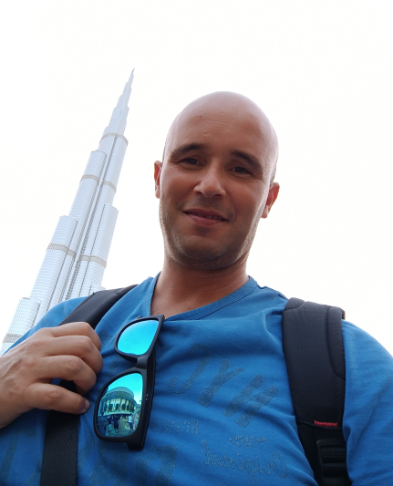

My name is Bruno Câmara, I live in Seixal, Portugal, I'm married, and father of
two sons. My nick is **bfcamara**, which is the name of this blog.
Professionally, I am a software engineer.

## The Present…

I am software engineer working as a Freelancer focused on the Microsoft .Net
stack, Cloud solutions, and DevOps. I am also a part-time teacher in Polytechnic Institute of Setúbal,
Portugal ([IPS](https://www.ips.pt)), in College of Business Administration
(ESCE), teaching classes related with software development.

## The Recent Past…

I worked in 2021 as a **backend software engineer at [OutSystems](https://outsystems.com)**
focused on the Microsoft .Net stack. OutSystems is a low-code platform which
provides the tools for companies to develop, deploy and manage omnichannel
enterprise applications.

I worked from 2016 to 2020 as a **Contractor for
[AppointMaster](https://appointmaster.com/)** focused on backend with the
Microsoft .Net stack, and DevOps with Azure DevOps.

## The Past…

I worked in 2016 at **Microsoft as a Software Development Engineer II** in Visual Studio Team Services / Team Foundation Server team (Azure DevOps).

I worked from 2013 to 2015 as a **Contractor in Visual Studio Team Services / Team Foundation Server** related projects.

From 2009 to 2013, I worked at **Agilior**, a company that I co-founded in 2004.
Agilior was a small consulting services company, and my work was to develop
software with Microsoft technology stack.

In 2009 I sold my part of Agilior. As a partner I learned a lot. I made
mistakes, but I also have learned too many lessons. I bootstrapped the company
with my co-founders, and I had to play many roles: recruitment, financial,
marketing, and development. However, my focus was always software development,
leading projects in Distributing Systems and Enterprise Application Integration,
using technologies such as Microsoft BizTalk, Windows Communication Foundation,
NServiceBus, etc. However,  my main goal as a partner was always to build a
culture, and a place where people feel good to work. I learned a lot.

In 1999, after graduating in computer science, I started my career at a
Portuguese bank, developing the Multi-Channel solution, using technologies such
as COM, Sql Server, XSLT, IIS, Javascript, etc.  

## And what else…

Well, I married when I was 25, in 2001, with my wife Filipa. We have two sons,
André, born in 2004, and Filipe, who born in 2007. It has been a awesome
journey, and being father it’s not easy. Prepare my sons for life is hard, and I
am always questioning myself what is the best to prepare them. My “free” time is
almost spent with my sons, watching their football training sessions and
matches, etc. I also spend a considerable time reading books and blogs, and
trying new technologies.