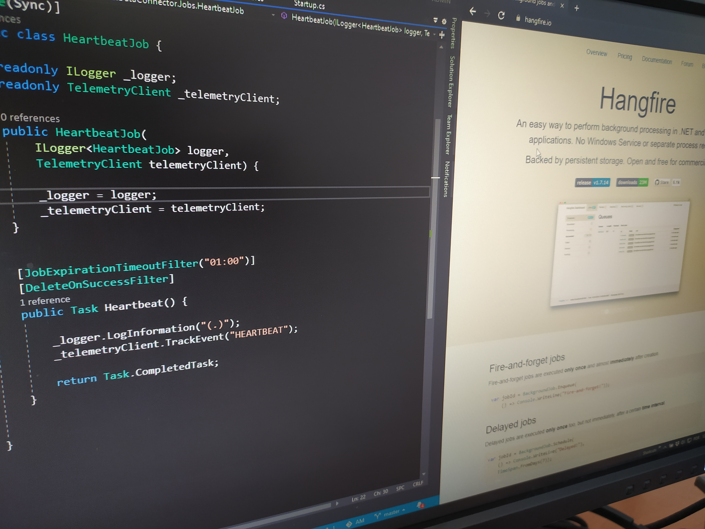
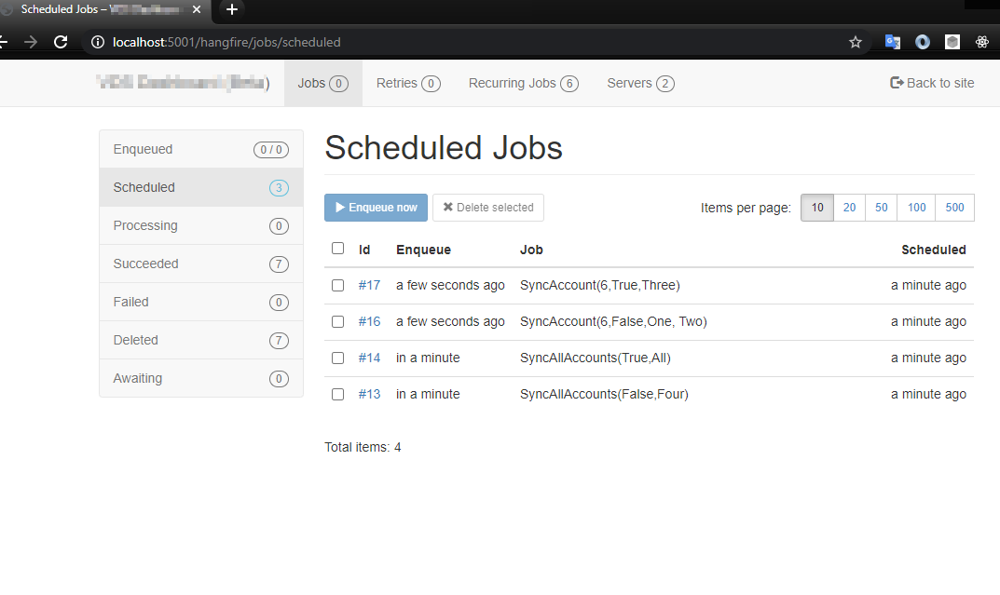
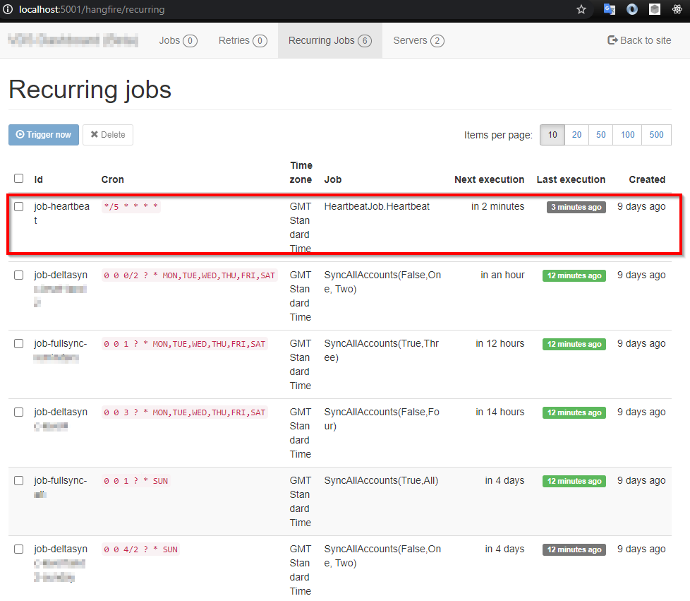
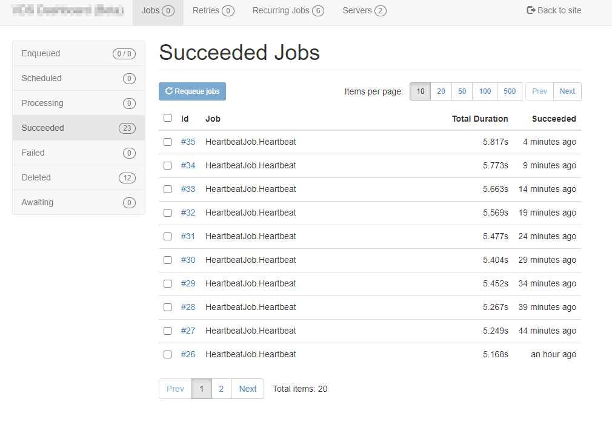
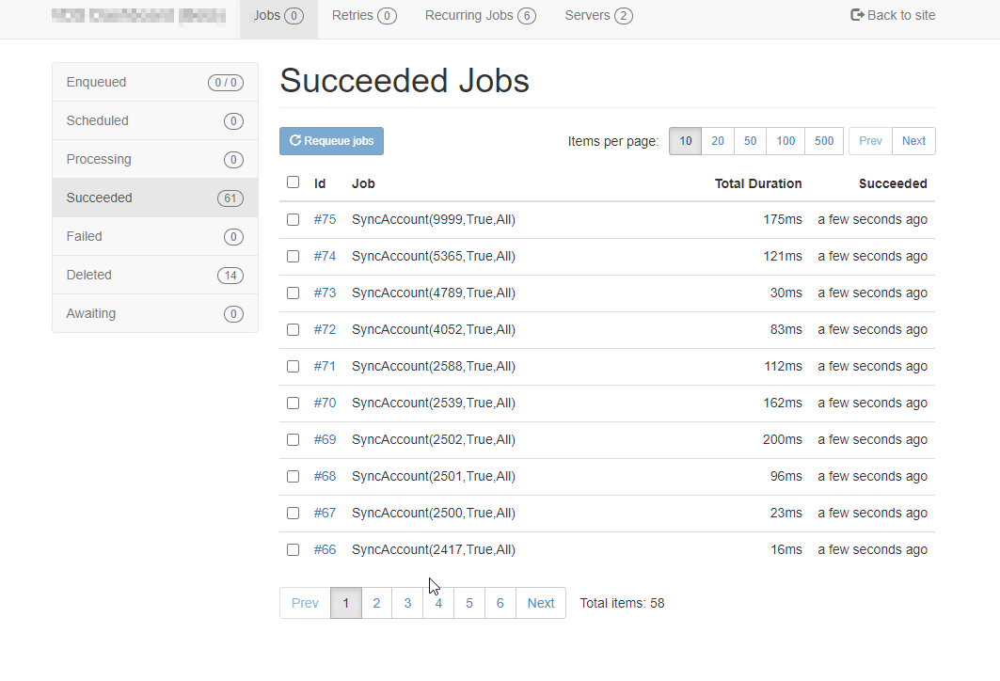
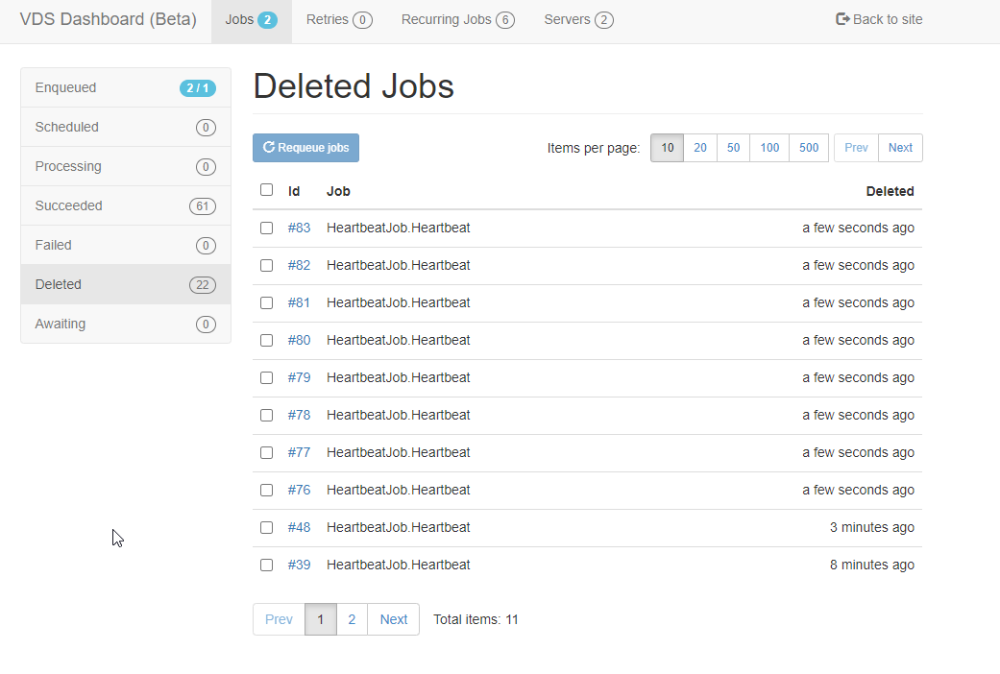
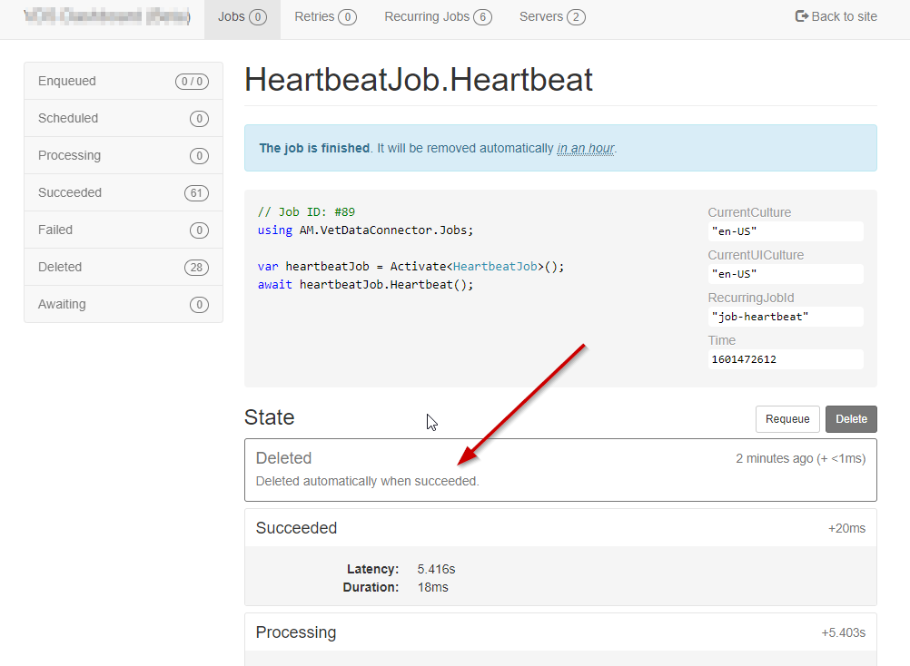

**TL;DR** - If you want to to hide some succeeded jobs from the Hangfire
Dashboard, you can do it by forcing them to be deleted as soon as they succeed,
and you can use a job filter for that purpose.

Many applications need some **background processing**, for example,  sending
thousands of campaign emails. One common scenario is to trigger these background
processing tasks in a schedule, for example, *"send campaign emails every night
at 1 am"*.

In the .Net world we have several tools and libraries at our disposal to perform
this kind of scheduled background processing. For example, we have
[Quartz.Net](https://www.quartz-scheduler.net/),
[Coravel](https://docs.coravel.net/), [Hangfire](https://www.hangfire.io/), etc.

Recently, I was involved in a project where I needed to build a data connector,
a piece of software to perform data synchronization between a 3rd party provider
and the customer system, in a multi-tenant fashion environment. Basically, for
each tenant the connector needs to run a task to perform the sync operation for
the given tenant.

**I used Hangfire as the processing background server hosted in a windows
service with [Topshelf](https://github.com/Topshelf/Topshelf)**. I won't go in
too much details about the architecture of this connector, but one of the
requirements was that it must be reliable and resilient, so as soon as the job
was created it should complete the task whenever possible, even if there are
some transient errors. **Hangfire provides a retry mechanism out of the box**,
so if an unhandled exception occurs during the job, Hangfire supports to
configure a retry strategy to take care of it. I also used some other retries
mechanisms before letting the exception to propagate to Hangfire, **for example
using [Polly](https://github.com/App-vNext/Polly) for HTTP retries**.

Another great thing that **Hangfire provides is a Dashboard where you can
monitor the whole activity in the Hangfire Server**, such as, Enqueued Jobs,
Processing Jobs, Retries, etc.



Even though the Dashboard feature is great, I also needed to integrate de
connector with Azure App Insights, which was the main telemetry system of my
customer. **One of the things that I was worried about was if the windows
service, for some unexpected reason, would stop working**. I configured Windows
Service to be retried in case of failures, but we never know what could happen,
and I was afraid that the stop would become unnoticed.

So, **to be 100% sure that I would be notified if the system stopped completely,
I decided to run a Heartbeat job every 5 minutes, which basically sends a custom
event to App Insights**.



And here is the simple code of the job.

```cs
public Task Heartbeat() {
    _logger.LogInformation("(.)");
    _telemetryClient.TrackEvent("HEARTBEAT");

    return Task.CompletedTask;
}
```

With this event being registered in the App Insights, it's very easy to take
advantage of Azure Monitor to create an alert to be triggered if we don't have a
heartbeat event in the last 15 minutes, which means that the service is not
running.

So, everything was in place to address my main fear, right? Yes, but I got a
collateral effect. **Suddenly I got a lot of noise in the Dashboard - every
"Heartbeat" jobs was being registered in the "Succeeded" page**. 



But I didn't want to pollute the "Succeeded" page with these Heartbeat job
entries, and I only care of those jobs related with the data sync. So, I needed
to remove them from there. I started to do some research and I eventually [found
some
solutions](https://discuss.hangfire.io/t/hide-certain-jobs-in-dashboard-log/2678/2)
but they consisted in changing the Dashboard itself, which is something that I
wanted to avoid.

So I though, there must be an alternative solution. **Hangfire supports some
extensibility via [Job
Filters](https://docs.hangfire.io/en/latest/extensibility/using-job-filters.html)**,
which are similar  to Filters in ASP.NET. In fact, for this same project, I
wrote some filters to manage how the jobs were being enqueued and to manage jobs
in queue. So I knew what I could do inside filters.

One thing that occurred to me is that **I could change a job to a "Delete" state
as soon as it succeeds, and in this case the job would be shown immediately on
the "Deleted" page**. Here is the simple filter that I eventually wrote.

```cs
public class DeleteOnSuccessFilter : JobFilterAttribute, IElectStateFilter {

    public void OnStateElection(ElectStateContext context) {
        if (context.CandidateState.Name == SucceededState.StateName) {
            context.CandidateState = new DeletedState {
                Reason = "Deleted automatically when succeeded."
            };
        }
    }
}
```

Basically it changes the candidate "Succeeded" state to a "Deleted" state
specifying a reason why it was deleted. Next you just need to apply this filter
attribute to the job method.

```cs
[DeleteOnSuccessFilter]
public Task Heartbeat() {
    _logger.LogInformation("(.)");
    _telemetryClient.TrackEvent("HEARTBEAT");

    return Task.CompletedTask;
}
```

And here is the result - **Succeeded jobs with only the jobs that I am
interested in**.



And the Deleted jobs with the noise of Heartbeats jobs.



And here is the detail with the reason why it was deleted.



I hope it helps if you have an identical scenario in Hangfire.
