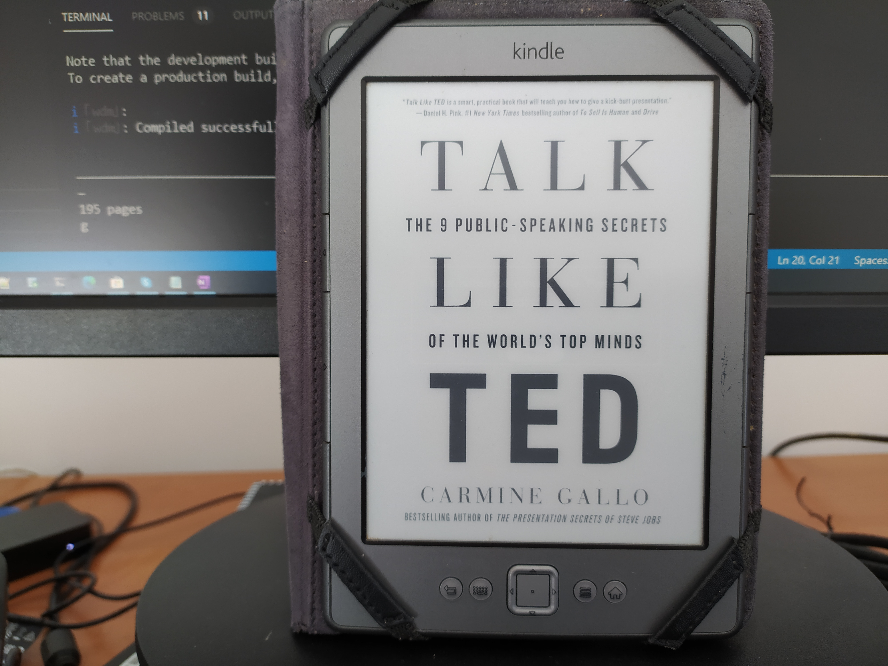

**Public Speaking** - it's one of my fears. But I think I am not alone, and
according to some studies, **it's a very common fear**.

I don't know exactly the reasons that cause us **to be terrified 😨 when we need
to speak in public** or to an audience - probably there are **social or
psychological reasons, or even physiological**, I don't know. But I do know how
I feel when facing an audience: **anxious, nervous, my heart starts beating
faster, I start sweating**, etc. Typically these feelings have its peak few minutes
before the presentation. But then, a few minutes after the presentation starts,
everything returns to a normal state, unless there are some issues with the
presentation itself, like a laptop crash, or the projector is broken, or
anything else that doesn't follow the plan, and in that case a lot of stress arises.
The root causes for these feelings might be: **fear to fail publicly, fear to
be negativelly commented, fear to be vulnerable, fear to be judged, fear to not
know the answer**, etc. Today, **if someone is on a stage, that person deserves my
empathy and my respect - that person is facing these fears fighting them in
the Arena** (I really like the term _Arena_, which I heard in the book [Daring
Greatly](https://www.amazon.com/gp/product/B00APRW2WC/)).

**In 2005** I was invited to be a speaker in TechDays Portugal, an event
sponsored by Microsoft, **to present a session about the [Fallacies of
Distributed
Computing](https://en.wikipedia.org/wiki/Fallacies_of_distributed_computing)**.
I presented the session with a friend and colleague (fortunately I was not alone
on the stage) and we decided to present it in a different way: **we presented as
a parody between two characters**. One of the characters was the Teacher, the
**"Software Architect"**, the reasonable, the prudent, and the experienced
professional; and the other character was the Student, the **"Cowboy Coder"**,
the developer who thinks is the best in the world and solves everything with a
few lines of code. Sounds familiar 🤠? The whole session was presented as a
conflict between these 2 characters, with a lot of drama. **Guess what character
I played:....The fu#$#%&& Cowboy**.

Since this session in 2005 got some positive feedback, we were invited again
**in 2007** to the same event. This time we did **two sessions**: one about
**Visual Studio Team Systems and Agile Methodologies** (XP, Scrum, etc.), which
can be partially watched [here](https://youtu.be/9a45oS1AEBk); and the other was
the continuation of the session of 2005 with the title **"The anxieties of an
architect"**.

For this session we decided to use the same recipe, **but now the "Cowboy Coder"
became the "Architect Wannabe", and the Professor was now the Doctor or the
Psychologist**. Basically the goal of the session was to discuss some questions
of that time, such as "XML vs JSON", or "REST vs WS-*", "ORM or not ORM", etc.,
that were the anxieties of the Architect Wannabe. **This time, I played the role
of the "Architect wannabe"**, and the whole session was designed to be pretended
as a psychoanalysis session - **I was the whole session laid down in a chaise
long, so vulnerable** 🛏️. OMG, what have I done? Recently, I found the
recording of this session, but I refuse to embed it here in the blog post itself
😄, but you can still watch it [here](https://youtu.be/OugyYA8lYHI). As far as I
remember, the feedback was better in 2005 than in 2007.

My feeling in general is, every time I watch a video of me speaking to an
audience, I typically **only see the negative points: I think my voice is not
good, I think I have the wrong posture, typically my jokes don't work, etc.**

Since then I stayed away of _"the stage spotlights"_. **This year 2020, last
February**, I was invited to **teach a class of Database Management Systems** in
the School of Business Administration at the Polytechnic Institute of Setúbal,
Portugal. This class belongs to the study plan of the 1st cycle college course
of IT Systems Management. **My role was limited to help students solving problems
at the labs, by putting in practice what they were being taught in theory**.
Basically we are talking about SQL problems, writing a lot of queries, something
that I am completely comfortable with.

But then it came the pandemic, and we were all confined to our homes, and **most
of the sessions were presented online via Microsoft Teams**, which is not the same
thing as being physically in the classroom. **I felt that the level of stress when
doing online sessions is much lower**.

But since I am going to continue to teach at the same institute, I decided to
invest sometime to know and understand **how to be a better communicator, and
how to improve the connection with your audience**. I started **watching great
speakers and revisiting great presentations. We can find them on
[TED](https://ted.com)** - go to the list of [TED
talks](https://www.ted.com/talks) and sort presentations by most viewed and we
are all presented with excellent speakers and inspiring talks. I confess that I envy
them, because they are really great and every talk is absolutely inspiring. **I
am aware that giving a TED talk is entirely different than teaching a class, but
I thought that I could gather something from these TED speakers**.

I've **read the book [Talk like
TED](https://www.amazon.com/Talk-Like-TED-Public-Speaking-Secrets/dp/1250041120)**.
The author, [Carmine Gallo](https://www.amazon.com/Carmine-Gallo/e/B001IGUTPG),
studied hundreds of TED Talks and compiled what they have in common
in order to be a great presenter. The author presents the **9 public-speaking
secrets**:

1. **Passion** - be passionate about your topic
2. **StoryTelling** - tell stories. We tend to pay attention to stories.
3. **Have a conversation** - deliver your talk as a conversation with a close
   friend. Be natural.
4. **Teach something new** - present something new to your audience. It can be new
   information, or just presented in a different and novel way.

5. **Have Jaw-Dropping Moments** - deliver shocking, impressive or surprising
   moments.

6. **Lighten Up** - deliver some humor, and don't take too seriously
7. **18-Minute Rule** - keep your presentation length approx. 18 minutes

8. **Multisensory experiences** - incorporate several senses in your
   presentation (sight, sound, touch, smell, and taste)

9. **Be authentic** - most people can spot a phony.

I enjoyed reading the book and I strongly recommend it to everyone that wants
improve their communication skills. I've also annotated each TED talk
referenced in the book and I am watching them to observe the
subtleties of the speaker.

**I would say that is hard do design a presentation with all the secrets in the
list, but I will definitely consider them on my next class or talk.**
