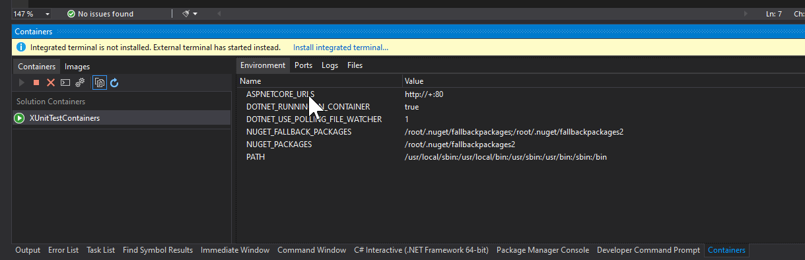

[Docker Support in Visual Studio
2019](https://docs.microsoft.com/en-us/visualstudio/containers/overview?view=vs-2019#docker-support-in-visual-studio-1)
is great, providing a great experience for **running and debugging ASP.NET and
Console applications in docker containers**. But when it comes to **Unit Test
projects the experience is not so great**.

My expectation was that the experience of running or debugging unit tests in
containers would be exactly the same as ASP.NET or Console apps. I was even
expecting that I could use the VS Test Explorer: as long as the Docker launch
profile was selected, I thought that the tests would be running/debugging inside
the container. Unfortunately it's not the case.

So, imagine that you are working with Visual Studio 2019 on Windows, building a
.NET Core project that would be deployed in Windows, but also in Linux, and **a
specific test is failing in Linux, and you want to debug it**. How can we do it
in a simple way?

Let's create a [xUnit](https://xunit.net/) (my test framework of choice) test
project.


For demonstrating purposes, let's create a simple test that asserts that the
test is running in a Linux container.

```cs
  [Fact]
  public void Test_is_running_in_linux_container() {

      Assert.True(RuntimeInformation.IsOSPlatform(OSPlatform.Linux);

  }
```

Unlike ASP.NET projects, **in Unit Test projects we don't have the option "Enable
Docker Support" while creating the project**. Though, the option is still
available via Solution Explorer. Let's try it.


Choose Linux as target. The result: a `Dockerfile` is added to the solution and
a new `Docker` launch profile is added to the list of profiles.


This is exactly the same behavior we get in an ASP.NET or Console project.
However, the running experience is not the same: **the integration between the
test explorer and the docker container does not work**.

That's what have triggered me to do some investigation. First we need to
**understand what VS is doing when we start debugging in a container with the
the `Docker` profile selected**.

**VS optimizes the Debug experience by using the so called [Fast build
mode](https://docs.microsoft.com/en-us/visualstudio/containers/container-build?view=vs-2019)**.
In this mode, the `docker build` command used by VS only uses the `base` stage
of the `Dockerfile`. Furthermore, when selecting the `Docker` profile a
**Project warmup** is triggered consisting in the following steps:

1. Check Docker Desktop is running and is set to the same operating system as
   project
2. Pull the image in the first stage (the `base` stage)
3. Build the `Dockerfile` and start the container

When VS starts the container, some volume mappings are created for the remote
debugger, and for Nuget folders. You can check the full `docker run` command in
the Containers Tools output window.


The container is now running. We can check it in the Containers window.



Now **we want to run our tests inside the container**. Basically we just need to run
the `dotnet test` command inside the container. We can do it using the `docker
exec` command.

```sh
docker exec -it <name_of_the_container> dotnet test
```

Let's see what happens.


We got the following error

> _It was not possible to find any installed .NET Core SDKs_

Now we need to look at the `Dockerfile` to understand what image is running.
This the `Dockerfile` originally generated by VS.

```docker
#See https://aka.ms/containerfastmode to understand how Visual Studio uses this Dockerfile to build your images for faster debugging.

FROM mcr.microsoft.com/dotnet/core/runtime:3.1-buster-slim AS base
WORKDIR /app

FROM mcr.microsoft.com/dotnet/core/sdk:3.1-buster AS build
WORKDIR /src
COPY ["XUnitTestContainers/XUnitTestContainers.csproj", "XUnitTestContainers/"]
RUN dotnet restore "XUnitTestContainers/XUnitTestContainers.csproj"
COPY . .
WORKDIR "/src/XUnitTestContainers"
RUN dotnet build "XUnitTestContainers.csproj" -c Release -o /app/build

FROM build AS publish
RUN dotnet publish "XUnitTestContainers.csproj" -c Release -o /app/publish

FROM base AS final
WORKDIR /app
COPY --from=publish /app/publish .
ENTRYPOINT ["dotnet", "XUnitTestContainers.dll"]
```

The first thing to notice is the comment at the top of the file. Follow that
link to understand the Fast build mode I mentioned earlier. **In the Fast mode,
only the `base` stage is used**. In this case **the `base` stage is using a
runtime image which does not include the .NET SDK required to run tests**. We
need to change our `Dockerfile` to use a .NET SDK image in the `base` stage. We
can also remove all the other stages since they are not being used when
debugging.

```docker
#See https://aka.ms/containerfastmode to understand how Visual Studio uses this Dockerfile to build your images for faster debugging.

FROM mcr.microsoft.com/dotnet/core/sdk:3.1-buster AS base
WORKDIR /app
```

Rebuild the solution. And let's try again to run the `dotnet test` command.


Great, we are now running our tests inside the container. Now we just need to
have a way **to launch the remote debugger and attach to the process responsible
to run the tests**.

When we run a `dotnet test` command, a new process is started to run
`vstest.console` to execute the tests, which in turn runs the `testhost.dll`. We
can **instruct `testhost` to pause execution waiting for a debugger to be
attached, by using an environment variable `VSTEST_HOST_DEBUG=1`**. Let's run
the same `docker exec` command passing this environment variable.

```sh
docker exec -it -e VSTEST_HOST_DEBUG=1 <name_of_container> dotnet test
```


We got the following info

> _A total of 1 test files matched the specified pattern. Host debugging is
enabled. Please attach debugger to testhost process to continue. Process Id:
643, Name: dotnet_

Now we just need to **attach the debugger to the `testhost` process**, which in
this case has its PID=643. Let's use the Container window to attach the debugger
to this process.


Wait a few seconds. You may see a screen informing that symbol loading was
skipped for `testhost.dll`.


Just click `Continue` and your breakpoint is hit.


You can now debug your test inside the Linux container. The whole debugging unit
tests experience is not ideal and I truly hope VS integrates Test Explorer with
Containers Tools very soon.
