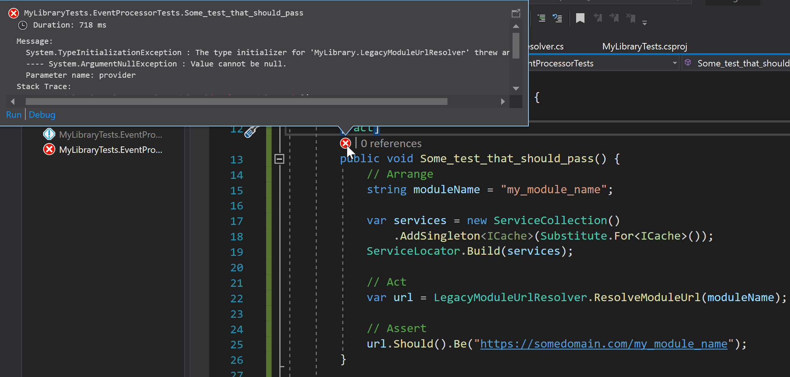

## ✅ The root cause of the failing test

In my [previous post](/posts/chasing-failed-test/) I have described the
troubleshooting experience of a failed unit test in CI/CD pipeline which was
passing on my machine. Today I want to explore what was causing the failure when
the test was running in Release mode, and passing when running in Debug mode.

Basically the root cause was a **static field inline initialization** that
was being initialized before some condition to happen.

## ✂️ Explaining the issue with a simple scenario

Let's imagine that we have the following implementation in a class with the
responsibility to resolve some URLs.

```csharp
public class UrlResolver : IUrlResolver {
    private readonly ICache cache;

    public UrlResolver(ICache cache) {
        this.cache = cache ?? throw new ArgumentNullException(nameof(cache));
    }

    public string ResolveUrl(string moduleName) {
        var cacheKey = $"{moduleName}_url_cache_key";
        string moduleUrl = cache.Get(cacheKey) as string;
        if (moduleUrl == null) {
            moduleUrl = ResolveUrlInternal(moduleName);
            cache.Set(cacheKey, moduleUrl);
        }

        return moduleUrl;
    }

    private string ResolveUrlInternal(string moduleName) {
        return $"https://somedomain.com/{moduleName}";
    }
}
```

In the context of an ASP.NET Core application, this class is used inside
controllers and it is being injected in its constructors as an
`IUrlResolver`. We are registering these services in the Startup class, and
everything works as expected.

```csharp
services.AddSingleton<ICache, MyCacheImplementation>();
services.AddSingleton<IUrlResolver, UrlResolver>()
```

The point here is that **the `UrlResolver` has a dependency of a `ICache` and it
requires an implementation of it**. Otherwise we are not able to create an
instance of a `UrlResolver` due the following code in its constructor.

```csharp
public UrlResolver(ICache cache) {
    this.cache = cache ?? throw new ArgumentNullException(nameof(cache));
}
```

## 🦹 Now the legacy code

Now let's imagine that we have some legacy code that has some **static public
methods** that need need to consume an instance of a `UrlResolver`. Since these
methods are static, one option is to use a static field to keep the
`UrlResolver` instance. But to create an instance of it, we need to pass an
instance of an `ICache`. **This legacy code is using a Service Locator pattern
to resolve instances of specific services, including the cache service**. So, we
could do something like this

```csharp
public static class LegacyModuleUrlResolver {

    private static readonly IUrlResolver urlResolver 
      = new UrlResolver(ServiceLocator.GetCache());

    public static string ResolveModuleUrl(string moduleName) {
        return urlResolver.ResolveUrl(moduleName);
    } 
}
```

This code is assuming that when we create the `UrlResolver` we have an instance of
`ICache` being returned by the Service Locator. Again. In the context of an
ASP.NET Core, everything works fine becasue the Service Locator is being initialized
and built during the Startup. **So, what is the chance of passing a null reference of
ICache when creating the static field?**. Very unlikely.

## 👎 And now the failing test

Now, let's imagine the following test.

```csharp
[Fact]
public void Some_test_that_should_pass() {
    // Arrange
    string moduleName = "my_module_name";

    var services = new ServiceCollection()
        .AddSingleton<ICache>(Substitute.For<ICache>());
    ServiceLocator.Build(services);

    // Act
    var url = LegacyModuleUrlResolver.ResolveModuleUrl(moduleName);

    // Assert
    url.Should().Be("https://somedomain.com/my_module_name");
}
```

**What do you think? Does it pass? Or does it fail?** Well, it really depends of the
target framework and configuration. For example, in .NET Core 3.1 the test passes in
both Debug and Release mode. In .NET 4.7.2, the test passes in Debug mode,
but it fails in Release (exactly the behavior I got in CI/CD pipeline issue).



The main question here is: **in what moment the static field inline
initialization runs?** We should only assume that it will run
before it's needed. **But we can't control when the CLR will run
the static initialization**. And if the initialization fails due a null instance
of `ICache`, the type will get unused for the whole application with a
`TypeInitializationException` and doesn't recover from this state, which is not good.

If we use a [static
constructor](https://docs.microsoft.com/en-us/dotnet/csharp/programming-guide/classes-and-structs/static-constructors)
the results are consistent and the test starts succeeding in all configurations.
But again, we can't control when the CLR will call the static constructor. We just know that
it will run before it's needed.

## 👍 Let's have full control and be lazy

When having these scenarios of depending of some services during the
initialization, we may want to have full control when the initialization
happens, and **we want to initialize just before we really need it (being really
really lazy). We can use a different approach with a
[`Lazy<T>`](https://docs.microsoft.com/en-us/dotnet/api/system.lazy-1?view=net-5.0)**.

```csharp
public static class LegacyModuleUrlResolver {

    private static readonly Lazy<IUrlResolver> urlResolver =
        new Lazy<IUrlResolver>(
            () => new UrlResolver(ServiceLocator.GetCache()),
            LazyThreadSafetyMode.PublicationOnly);

    public static string ResolveModuleUrl(string moduleName) {
        return urlResolver.Value.ResolveUrl(moduleName);
    } 
}
```

By using a `Lazy<T>` we have full control when the initialization will happen.
In this case the initialization will occur the first time the static method
`ResolveModuleUrl` is called, when evaluating the `Value` property of the lazy
instance of `urlResolver`. I am also using the option
[`LazyThreadSafetyMode.PublicationOnly`](https://docs.microsoft.com/en-us/dotnet/api/system.threading.lazythreadsafetymode?view=net-5.0)
to not cache the exception if for some reason the initialization fails, to
prevent the `TypeInitializationException` described earlier.

This was a simple explanation why the test was failing. In reality the test
was much more complex, involving several assemblies provided by several
nuget packages. One of the methods in the test was swallowing
exceptions, so it was being completely silence, and the test was failing due an
assert. This made the diagnostics even harder. **Net-net, sometimes it's good to
have full control when things happen and to be lazy in initialization until we
really need it**.
