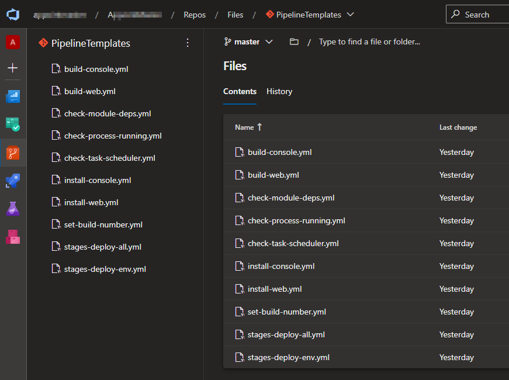
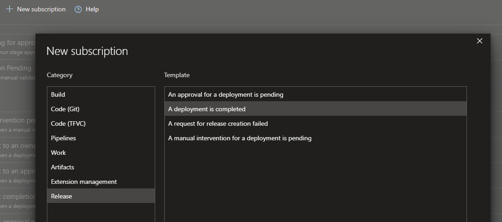

## 🌲 CI/CD Pipelines as Code

If you have started using Azure DevOps several years ago (maybe its name was Visual
Studio Team Services by then), then you are probably still using the [Classic
Build and
Release](https://docs.microsoft.com/en-us/azure/devops/pipelines/get-started/pipelines-get-started?view=azure-devops#define-pipelines-using-the-classic-interface)
pipelines to fulfill your CI/CD needs. There is nothing wrong with these Classic
Pipelines but the trend over the years has been to follow the **Everything as
Code** approach, including **CI/CD Pipelines as Code**, and [Azure Pipelines also supports it by using YAML Pipelines](https://docs.microsoft.com/en-us/azure/devops/pipelines/get-started/pipelines-get-started?view=azure-devops#define-pipelines-using-yaml-syntax).

There are obvious **advantages in having CI/CD Pipelines as Code**, in which its
definitions live in a source control repo as YAML text files:

- we can **use the same code flow for CI/CD**, for example using pull requests to make a
  change in the pipeline and require a review from a specific group of
  people;
- it's **easier to check the history** of changes
- we can use the **same tooling we are used for source control**
- it's **easier to reuse and share** pipelines common blocks
- it's **easier to collaborate** on pipeline definitions

Over the last few days I have been working in a migration to transform
Classic Build and Release pipelines into YAML Pipelines.

## 🤼‍♂️ Unify Build and Release Pipelines

**In the Classic approach the Build and the Release are two different pipelines**.
The Classic Build doesn't support multi stages and typically finishes by
publishing the build output artifacts. Following is an example of a Classic
Build pipeline.

**The build artifacts are then consumed by a classic Release pipeline** where we
have the different stages (DEV, QA, PROD, etc.) to where we want to deploy.
Following is an example of a Classic Release pipeline.

The team was not using any dependency between classic release stages, and the
deployments to all stages (except to DEV) were being triggered manually, as we
can see in the image below.

**With the YAML approach we can have multi stages** which allows us to have in a
single pipeline both the Build (as the first stage) and each of the deployment stages
(DEV, QA, PROD. etc.). **The main difference is that in the YAML approach we can
have just a pipeline definition instead of two in classic** (Build definition and Release
definition).

We can also specify dependencies between stages, specifying that each deployment
stage depends on the build stage, as we can see in the image below.

## 🏗️ Convert Task Groups into Templates

Using the Classic approach, **the team has built several [Task
Groups](https://docs.microsoft.com/en-us/azure/devops/pipelines/library/task-groups?view=azure-devops)**
over the years, which encapsulate sequences of tasks to run in a classic build or
release pipeline.

Using the **YAML approach these task groups were converted into [YAML
templates](https://docs.microsoft.com/en-us/azure/devops/pipelines/process/templates?view=azure-devops)**.
We have decided also to use an isolated git repository to host all these
templates to allow to reuse them in different projects and/or repos.

The **motivation to use YAML templates is the same of Task Groups: encapsulate common logic** in templates to be able to use it in several pipeline definitions (we want pipeline definitions to be very thin, delegating the heavy work to templates).

## 💻 Use Environments in YAML

In the classic approach the team was mostly relying on
[msdeploy](https://www.iis.net/downloads/microsoft/web-deploy) to deploy
packages to VMs. **With YAML Pipelines we can use the concept of
[Environment](https://docs.microsoft.com/en-us/azure/devops/pipelines/process/environments?view=azure-devops)**,
which is a collection of resources that we can target easily with
**[Deployments](https://docs.microsoft.com/en-us/azure/devops/pipelines/process/deployment-jobs?view=azure-devops)**
from a Pipeline.

We just need to **add resources to environments** (VMs in this scenario) and specify which checks should be performed.

Adding a VM resource to an environment means that **this VM needs to have the
Azure Pipeline Agent running** on that VM, which means that is much easier to
perform some tasks on the target server (in the classic approach these tasks
were being performed via msdeploy which is not easy to configure to make
it work correctly when interacting remotely from the the build server).

## 💂 Use Approvals instead of Manual Trigger Deployments

As mentioned earlier, in the classic approach, the team was using **Manual
Trigger Deployments**. As I am writing this post, YAML Pipelines don't support
Manual Trigger Deployments, despite the fact that is a [feature requested by
many](https://developercommunity.visualstudio.com/t/manually-triggered-stages-in-yaml-multi-stage-pipe/697467)
for a long time.

The best workaround to simulate a manual trigger deployment is to use
**Environment Approval checks with a timeout**.

However, be aware that the **stage will be in a Waiting state while the approval is pending**.

The only drawback with this workaround is that **the whole pipeline is shown as Queued while not all stages complete** (and also that that the time elapsed is still counting), which might not reflect exactly what the team wants.

**If the approval times out, the stage is skipped, and the user has the option  to rerun the stage manually**. You can play with the timeout value to accommodate your team preference of showing the Pipeline as "Queued" or "Completed" (even if some stages were skipped).

## 📧 Stage Completed Notification

Finally, some team members are used **to be notified when a classic deployment is completed**.

However, for YAML Pipelines, in the Notifications page, we have **only available the notifications that a stage is waiting for an approval or [manual validation](https://docs.microsoft.com/en-us/azure/devops/pipelines/tasks/utility/manual-validation?view=azure-devops&tabs=yaml)**.

I hope the events of stage state change will be available in the future. Nevertheless it's possible to have this notification via [Service Hooks](https://docs.microsoft.com/en-us/azure/devops/service-hooks/overview?view=azure-devops).

For now, and since the team was using [Slack](https://slack.com), we have configured [Azure Pipelines Slack App](https://slack.com/apps/AFH4Y66N9-azure-pipelines) to **post a slack message when any stage is completed**.

That's all for now.
