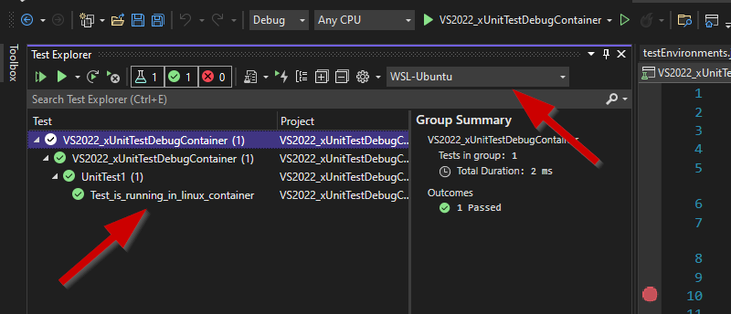
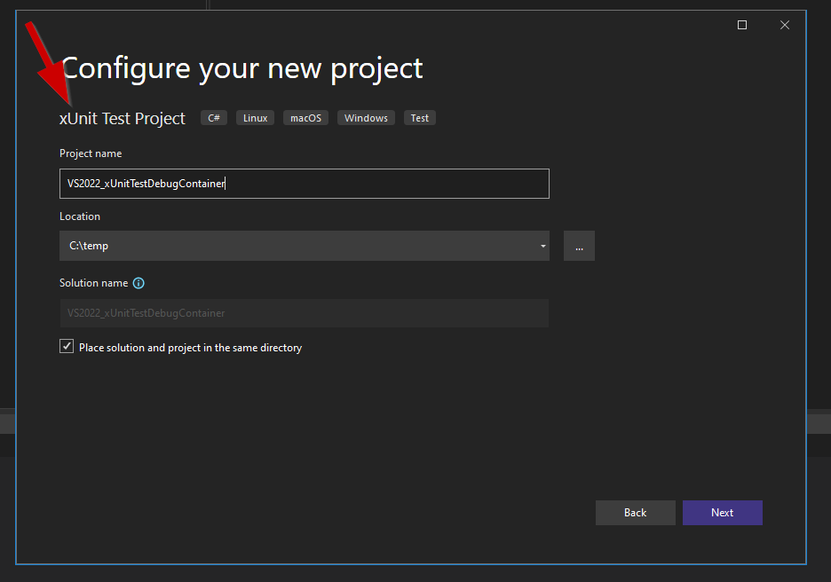
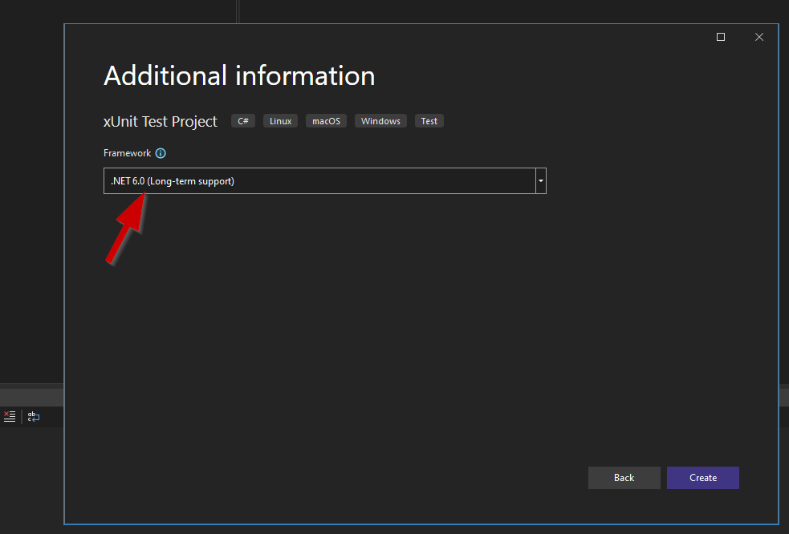
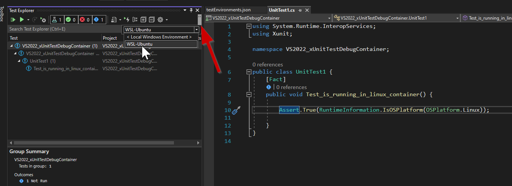
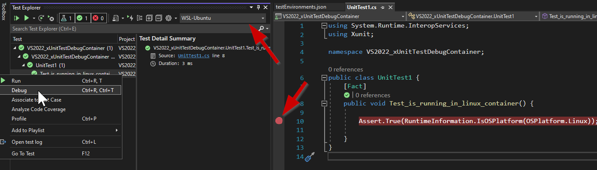
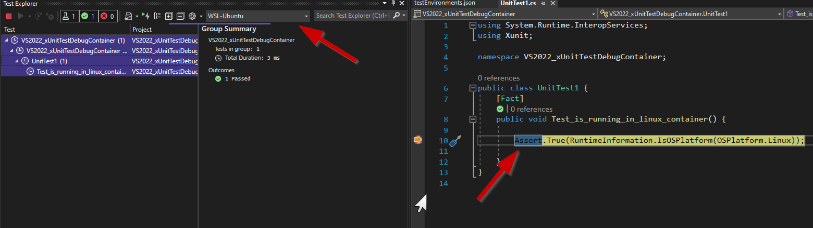
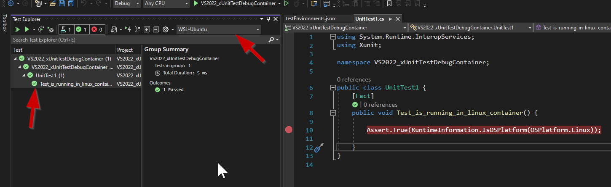
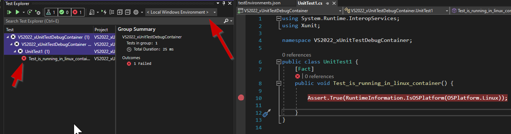

Several months ago I wrote a [blog post explaining how could we debug a unit
test running in a Linux container using Visual Studio
2019](/posts/vs2019-debugging-unit-test-in-container/). In that post I mentioned that
the experience is far from being great in VS2019. It was possible, but it
required some manual steps.

When we want to debug a unit test running in a Linux container, our
**expectation is to have the same experience as when debugging locally**:

    1. Go to Test Explorer
    1. Right Click on the Test and select Debug
    1. The debugger starts and stops in a breakpoint inside the test
  
That's exactly what **Visual Studio 2022 brought to us with [Remote
Testing](https://docs.microsoft.com/en-us/visualstudio/test/remote-testing?view=vs-2022)**. Let's see how it works.

Create a [xUnit](https://xunit.net/) test project.



Choose .NET 6.0



For demonstrating purposes, let's create the same test used when demonstrating how to debug in Visual Studio 2019. This is a **simple test that asserts that the test is running in a Linux container**.

```cs
  [Fact]
  public void Test_is_running_in_linux_container() {

      Assert.True(RuntimeInformation.IsOSPlatform(OSPlatform.Linux);

  }
```

Now add a new file `testEnvironments.json` to the root of the solution

```json
{
  "version": "1", // value must be 1
  "environments": [
    {
      "name": "WSL-Ubuntu",
      "type": "wsl",
      "wslDistribution": "Ubuntu-20.04"
    }
  ]
}
```

Basically I am **adding a new test environment to run my tests in a WSL Ubuntu
20.04 distribution**. To check the list of distributions you can run `wsl
--list` in a command prompt. In Test Explorer you now have a dropdown with the
list of test environments. Let's select the test environment just added,
`WSL-Ubuntu`.



**Note**: if you don't see the new environment, then close Visual Studio and launch it
again. This is an experimental feature and I have experienced some issues while
playing with this feature.

Put a breakpoint in the test that you want to debug and select it in Test
Explorer to start debugging it.



Debugger stops at the breakpoint



And the test passes.



Change the environment to `< Local Windows Environment >` and you will see that
the test fails.



Thank you Visual Studio 2022 for greatly simplify this experience of remote testing.
