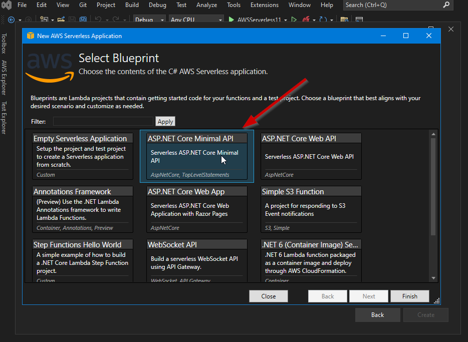

Are you **hosting your HTTP API in a AWS Lambda?** Are you aware of AWS Lambda
concurrency model regarding HTTP concurrent requests? Let's investigate.

## HTTP APIs

When you build a HTTP API using your preferred language and HTTP framework, you
**expect that the HTTP framework will live in a process which will handle
multiple concurrent requests**, right?

When it comes to AWS Lambda that doesn't happen: **one instance of a AWS Lambda
processes one HTTP request at a time**. 

You are maybe asking now: **what happens then if a second HTTP request comes in
while still processing the first request?** Well, the second request will be
handled by a different AWS Lambda instance. This 2nd AWS Lambda instance can be
a new one, if no instances are ready, or an existing one that is idle (not
processing requests) and ready to process the new request (because it has
handled a recent previous request). This is all done magically and under the
hood by the AWS Lambda service.

**Is this really a problem?** I don't think so. However, I think it is
counterintuitive at first because it's not what we are used to when handling
HTTP requests. **I think it's a smart design indeed, because the computing becomes
more predictable since every instance only handles one request at a time**.

So, what are really the consequences of this design? **Maybe we will have more
cold starts than we were expecting, particularly in cases where we have a burst
in concurrent requests**.

## Cold Starts

A cold start happens when a new AWS Lambda instance is required to be created to
handle the request coming in, mostly because there are no AWS Lambda instances
ready available. When this happens, **the AWS Lambda service needs to spin up a
new execution environment** with the memory, runtime, and configuration specified
in the function. Once finished, AWS Lambda runs any initialization code - in
HTTP APIs means running the bootstrap of the framework, typically registering
services in Dependency Injection (DI) containers, configuring HTTP midleware,
etc (the code in `Execute initialization code` below).


<small>_(Source: [AWS](https://docs.aws.amazon.com/lambda/latest/operatorguide/execution-environments.html))_</small>

When an instance finishes to handle a HTTP request, **the instance is kept warm
and ready to handle another HTTP request**. In subsequent HTTP requests, if a warm
instance is available, only the `Execute handler code` is invoked.  If no HTTP
request comes in for a while, the AWS Lambda service will eventually destroy the instance
after a while of inactivity.

We can build something really quick to show this behavior. I am going to
ilustrate the steps with a ASP.NET Core 6 Minimal API. You need to have
installed the [AWS Toolkit for Visual Studio 2022](https://aws.amazon.com/visualstudio/).

1. Create a new **AWS Serverless Application (.NET Core - C#)** in Visual Studio 2022

    

1. Select the **Blueprint ASP.NET Core Minimal API**

    

1. Change the code to **add some delay while serving a HTTP request** to give us
   time to launch new requests.

    On file `Program.cs` replace the line
    ```csharp
    app.MapGet("/", () => "Welcome to running ASP.NET Core Minimal API on AWS Lambda");
    ```

    by the following code

    ```csharp
    app.MapGet("/", async () => {
      // Wait 5 seconds
      await Task.Delay(5000);
      return "Welcome to running ASP.NET Core Minimal API on AWS Lambda\n";
    });
    ```

1. **Publish to AWS Lambda**

    

    Give a name to your stack (a stack is a group of resources representing a
    serverless app).

    

    You can follow the deployment progress and once finished you should see the
    Stack view tab

    

1. **Test your endpoint in the browser**

    The stack that was created includes an API in AWS API Gateway. You can check
    the URL in the Lambda page that will trigger the function.

    

    Click on the link and you should wait aprox. 5 seconds until you have the
    answer in your browser.

    

1. **Launch 10 concurrent requests**

    At this point we should have a AWS Lambda instance ready to handle more
    requests. So let's launch 10 simultaneous requests to see what happens. Open
    a bash or a windows subsystem for linux (wsl) and run the following command

    ```bash
    seq 10 | xargs -I{} -P 10 curl <url_api_gateway>
    ``` 

    The requests are launched concurrently, wait aprox. 5 seconds, and you will
    see something like this.

    

1. **Monitoring concurrent executions**

    Now it's time to check what happened in terms of number of instances.
    Probably you were expecting that the instance that served our first request
    in browser would be used to serve all the concurrent requests. But as I've
    mentioned before, it's not what happened. We can check the Monitor ->
    Metrics tab in the function page.

    

    As you can see the AWS Lambda service has created 10 execution environments.

1. **Check number of cold starts**

    On total we have made 11 requests, one initially in the browser, and then 10
    with `curl`. Let's see what the logs are saying (AWS CloudWatch logs).

    

    The intial request (browser) was served by a new execution environment, so we
    had a cold start. A cold start is easy to identify in the logs by searching
    for a `Init Duration` in the `REPORT` log.

    Next, when we launched 10 concurrent requests, the first request comming in
    reuses the execution environment that was created for the initial request
    completed in the browser (the instance was kept warm). **For the remaining 9
    requests the AWS Lambda service has created new 9 execution environments,
    hence 9 cold starts**.


When building synchronous APIs like a HTTP API, **we want to avoid cold starts,
particularly if it's a customer facing API**, because it will include more latency
in the whole request-reply flow. But a cold start is almost inevitable if we
want a scale to zero approach and avoiding to pay for resources when there is no
activity (HTTP requests).

## Minimizing Cold Starts

To minimize the impact of cold start we can:
- **Reduce the number of cold starts**
- **Reduce the time of a cold start**

To **reduce the number of cold starts** we can use [**Provisioned
Concurrency**](https://docs.aws.amazon.com/lambda/latest/dg/provisioned-concurrency.html).
Provisioned concurrency initializes a requested number of execution environments
so that they are **prepared to respond immediately to your function's invocations**.
Be aware that configuring provisioned concurrency **incurs charges to your AWS
account**.

To **minimize the time spent in a cold start** there are some things we can do:
- keep our package small
- minimize library dependencies
- adjust memory function (you can use [AWS Lambda Power
  Tuning](https://docs.aws.amazon.com/lambda/latest/operatorguide/profile-functions.html))
- be lazy in initialization

## Can your HTTP API live with Cold Starts?
 
It really depends. First, we need to **measure the cost of a cold start in terms
of latency**. For example, the logs above are showing that a cold start takes
aprox. 500ms (for a very simple scenario). A cold start duration varies based on
programming language, runtime, etc.  

Second, we need to **understand how our API is being used by consumers, who are
these consumers, and what are the patterns of usage during the day, day of week,
etc**. Based on that knowledge we can have an idea of what is the impact of a
cold start in the flow in which we are using our function.

If we anticipate problems caused by cold starts, **we should analyze what is the
cost (money) of configuring provisioned concurrency**. Furthermore, **consider
using [Provisioned Concurrency with Application Auto
Scaling](https://docs.aws.amazon.com/lambda/latest/dg/provisioned-concurrency.html#managing-provisioned-concurency)**
to adjust the number of provisioned instances based on usage. **Nevertheless, we
need to be aware that we will be charged by using provisioned concurrency**.

## AWS Serverless alternatives to AWS Lambda

If we are not confortable with the concurrency execution model provided by AWS
Lambda, we can always use some alternatives in AWS:

- [**AWS App Runner**](https://aws.amazon.com/apprunner/) - a fully managed
  container application service with auto scaling based on Max Concurrency - we
  define the max number of requests that will trigger the scale-up process. The
  AWS App Runner uses **the normal execution model where a container instance
  can serve multiple concurrent requests. There is always at least one instace
  provisioned**.

- **[Fargate](https://aws.amazon.com/fargate/)** with [AWS
  ECS](https://aws.amazon.com/ecs/) or [AWS EKS](https://aws.amazon.com/eks/)
  (Kubernetes) - We are probably already using Kubernetes or any other container
  orchestration engine, so we can always use it to host our HTTP API. This route
  provides more flelibility and full control, however is the route that is more
  complex. 

## Conclusion

When analyzing a specific scenario, **AWS Lambda is typical the option that I
consider first in AWS when going serverless** . It's **really simple to use**,
**integrates seamlessly with a lot of AWS Services** (SQS, S3, SNS, CloudWatch,
API Gateway, etc.), and provides a lot of great features specially when it comes
to scalability: **scale-up or scale-down** (scale to zero).

If we want a _"scale to zero"_ approach, then **we need to be aware of cold
starts**, particularly in case of synchronous APIs, where it can cause some
impact in terms of latency. If the scenario being analyzed cannot live with cold
starts, **I would consider using AWS App Runner** which has a very interesting
[pricing model](https://aws.amazon.com/apprunner/pricing/).

Regarding **Kubernetes** (AWS EKS), I think it makes totally sense when it's an
initiative enterprise wide. The learning curve is not negligenciable (even when
we don't need to install and administer the cluster like in AWS EKS), and
typically we need to spend some time configuring the cluster until we have all
the knobs needed. For example, if we want to have auto-scale based on events we
might need to have [KEDA](https://keda.sh/) installed (that's exactly what
Microsoft did with [Azure Container
Apps](https://docs.microsoft.com/en-us/azure/container-apps/overview)).

See you next time. I will continue to explore other scenarios like gRPC and
WebSockets.
