In a Microservices architecture, the number of services grows organically and
some services need to talk to other services. Ideally the inter-services
communication should be asynchronous following a publish-subscribe pattern, but
in practice we have some services that need to follow a request-reply pattern.
This is typically the case when we have Backends-for-Frontends (BFF) acting as
separate API gateways for each front-end client. These BFFs need to talk to
other services, typically issuing queries to fetch data, or commands to perform
use cases being handled by the downstream service. Most of the time these
interactions are made through REST APIs, and we need to have a way to authorize
these requests, even if all these services are running within the internal
network perimeter with restrictions from the outside world (Zero Trust).

Besides BFFs, another scenario where we need to authorize a service is when we have
external services running on-premise, outside of the cloud, and there's no human
interaction in these services, for example having a windows service that
collects some data from on-premise installations and send it to a service that
lives in the cloud.

## OAuth 2.0 - Client Credentials Grant flow ##

There are several solutions to implement **Service-to-Service authorization**,
known also as Machine to Machine (M2M) authorization, such as API keys, Mutual
TLS, OAuth, etc. In this post I want to explore using **OAuth 2.0 with the
Client Credentials Grant flow** in the context of **ASP.NET Core** and **Amazon
Cognito**.

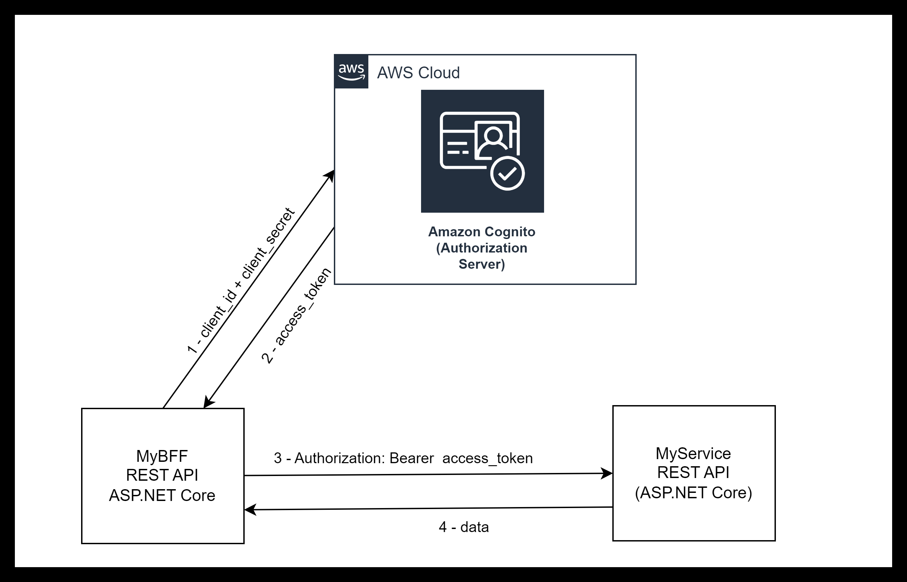

- When MyBFF (client) needs to call MyService, if it doesn't have a valid access
  token yet, makes a request to the Amazon Cognito (Authorization Server) with
  `client_id` and `client_secret`
- Amazon Cognito validates the request and returns the `access_token` with a
  given expiration in `expires_in`
- MyBFF calls MyService to get data passing the `access_token` as a `Bearer`
  token in the `Authorization` header
- MyService validates the request and returns the data when the Bearer token is valid.

## Amazon Cognito Setup ##

To setup Amazon Cognito for our scenario we need the following resources:

1. **User Pool** - even though we won't have real users in this pool, a User Pool is the materialization of an Authorization Server in OAuth language
1. **Cognito domain** - expose the authorization server OAuth endpoints in a domain
1. **Resource Server** - it represents MyService. We will have as many resource
   servers as the number of services.
1. **Client** - it represents the Backend-for-Frontend MyBff. We will have as
   many clients as the number of services that are calling other services.

I'm going to use CloudFormation to create all these resources instead of AWS console because:

- I love CloudFormation - I don't care if I'm locked in to AWS. The truth is
  that CloudFormation is so simple and so powerful that I discard any other IaC
  alternative (for example Terraform) when managing resources inside AWS
- Amazon Cognito in console is not very intuitive. In fact I think that's one of
  the disadvantages of Amazon Cognito, when comparing with other solutions like
  Auth0 (considered by many  the best solution in the market in this field). I think
  Amazon Cognito still needs to be polished to remove some friction when used by
  developers and cloud architects.

### Creating a User Pool ###

```yaml
  # Create a user pool
  MyServicesUserPool:
    Type: AWS::Cognito::UserPool
    Properties:
      UserPoolName: "MyServicesUserPool"
      # Disable Self-Service Account Recovery
      AccountRecoverySetting:
        RecoveryMechanisms:
          - Name: admin_only
            Priority: 1
      # Disable Self-Service Signup
      AdminCreateUserConfig:
        AllowAdminCreateUserOnly: true
      # Just in case a user is created by admin
      MfaConfiguration: "ON"
      EnabledMfas:
        - SOFTWARE_TOKEN_MFA
```

The important thing here is to disable all self-service operations from
end-users since we won't have any users registered in the pool. You can check
the result in AWS console.

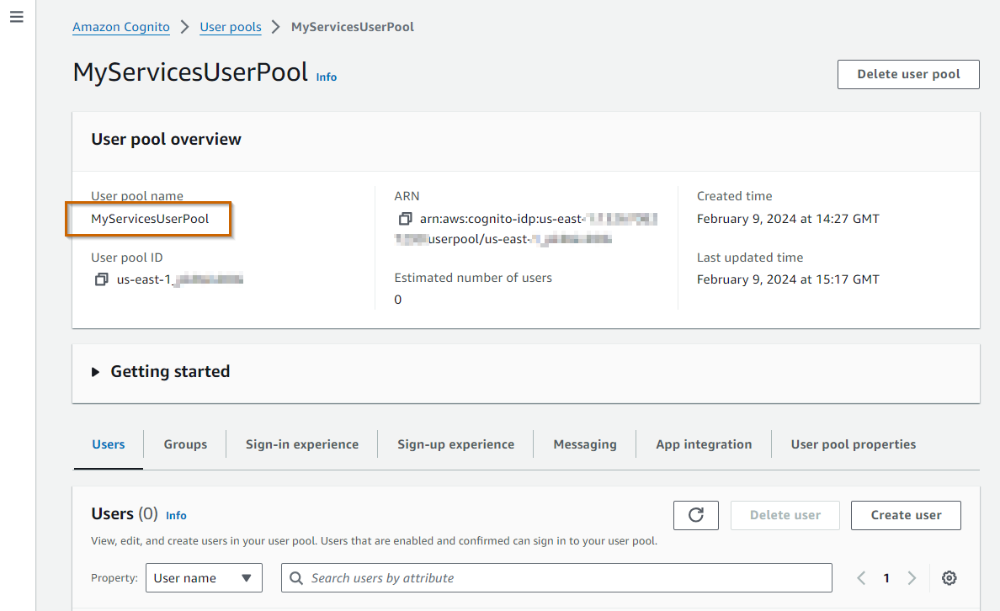


In the **Sign-in experience** tab

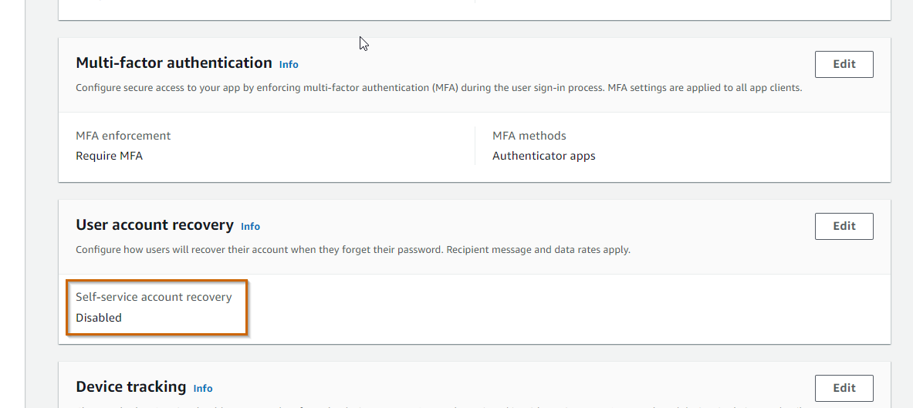

In the **Sign-up experience** tab

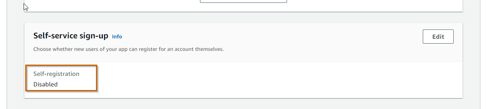


### Cognito domain ###

```yaml
  # Creates a domain with oauth endpoints
  MyServicesUserPoolDomain:
    Type: AWS::Cognito::UserPoolDomain
    Properties:
      Domain: replace-your-domain-here
      UserPoolId: !Ref MyServicesUserPool
```

We are using a AWS domain:
https://replace-your-domain-here.auth.us-east-1.amazoncognito.com

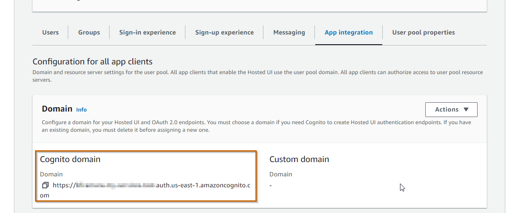

We could have used a custom domain insteas of a Amazon Cognito domain.

### Creating a Resource Server for MyService ###

```yaml
  # Resource Server for MyService
  MyServiceUserPoolResourceServer:
    Type: AWS::Cognito::UserPoolResourceServer
    Properties:
      Identifier: MyService
      Name: MyService
      # Organize scopes
      Scopes:
        - ScopeName: weather_read
          ScopeDescription: Grantes the ability to read weather
      UserPoolId: !Ref MyServicesUserPool
```

We can register whatever scopes we want to support in our Service. In this case we are just registering one scope `MyService/weather_read` that grants the ability to read weather data from MyService (which will expose an endpoint to retrieve weather data).

In the **App Integration** tab

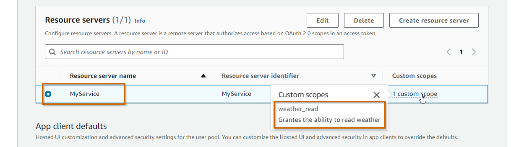

### Create a client for MyBFF ###

```yaml
  # Client for MyBFF
  MyBFFUserPoolClient:
    Type: AWS::Cognito::UserPoolClient
    DependsOn: MyServiceUserPoolResourceServer
    Properties:
      ClientName: MyBFF
      GenerateSecret: true
      AccessTokenValidity: 1  # Hours
      RefreshTokenValidity: 30  # Days
      AllowedOAuthFlows:
        - client_credentials
      AllowedOAuthFlowsUserPoolClient: true
      AllowedOAuthScopes:
        - MyService/weather_read
      EnableTokenRevocation: true
      ExplicitAuthFlows:
        - ALLOW_REFRESH_TOKEN_AUTH
      UserPoolId: !Ref MyServicesUserPool
```

Basically we are registering a client, with a secret, and that is only allowed to trigger the `client_credentials` flow, and the scopes `MyService/weather_read`. In another words, we are allowing this client to talk to MyService.

In the AWS console, in the App Integration tab

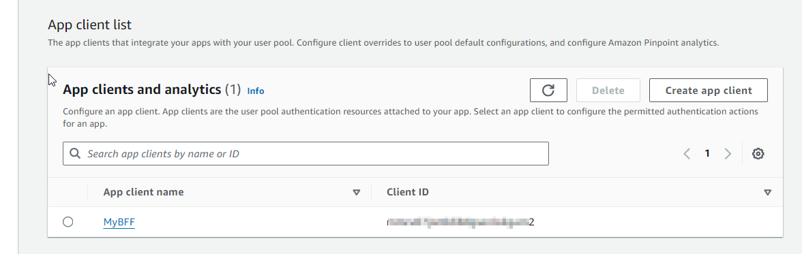

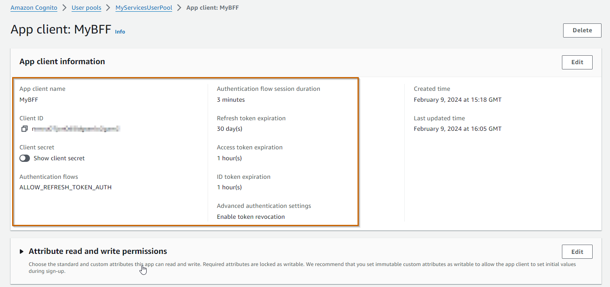

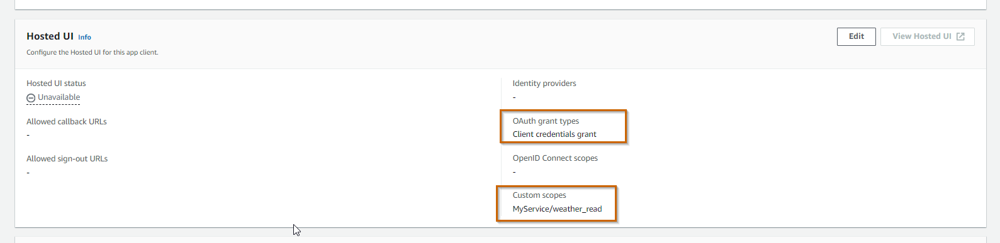

### CloudFormation Template for Client Credentials Grant flow

I'm not setting all the **Advanced Security** configuration available that we would use in a regular User Pool supporting other flows that deal with real users (Authorization Code, Implicit, etc,). I'm also not enabling AWS Web Application Firewall (WAF), which is something that we would do in a real scenario.

This is the template I am using for the example of this blog post.

```yaml
AWSTemplateFormatVersion: "2010-09-09"

Description: AWS Cognito with OAuth Client Credentials Grant flow

Resources:
  # Create a user pool
  MyServicesUserPool:
    Type: AWS::Cognito::UserPool
    Properties:
      UserPoolName: "MyServicesUserPool"
      # Disable Self-Service Account Recovery
      AccountRecoverySetting:
        RecoveryMechanisms:
          - Name: admin_only
            Priority: 1
      # Disable Self-Service Signup
      AdminCreateUserConfig:
        AllowAdminCreateUserOnly: true
      # Just in case a user is created by admin, we require MFA
      MfaConfiguration: "ON"
      EnabledMfas:
        - SOFTWARE_TOKEN_MFA

  # Creates a domain with oauth endpoints
  MyServicesUserPoolDomain:
    Type: AWS::Cognito::UserPoolDomain
    Properties:
      Domain: bfcamara-my-services-test
      UserPoolId: !Ref MyServicesUserPool

  # Resource Server for MyService
  MyServiceUserPoolResourceServer:
    Type: AWS::Cognito::UserPoolResourceServer
    Properties:
      Identifier: MyService
      Name: MyService
      Scopes:         # Organize scopes
        - ScopeName: weather_read
          ScopeDescription: Grantes the ability to read weather
      UserPoolId: !Ref MyServicesUserPool

  # Client for MyBFF
  MyBFFUserPoolClient:
    Type: AWS::Cognito::UserPoolClient
    DependsOn: MyServiceUserPoolResourceServer
    Properties:
      AccessTokenValidity: 1
      AllowedOAuthFlows:
        - client_credentials
      AllowedOAuthFlowsUserPoolClient: true
      AllowedOAuthScopes:
        - MyService/weather_read
      ClientName: MyBFF
      EnableTokenRevocation: true
      ExplicitAuthFlows:
        - ALLOW_REFRESH_TOKEN_AUTH
      GenerateSecret: true
      RefreshTokenValidity: 30
      UserPoolId: !Ref MyServicesUserPool

```

At this point we can test the Token endpoint to get a new `access_token` https://replace-your-domain-here.auth.us-east-1.amazoncognito.com/oauth2/token

```bash
curl --location 'https://replace-your-domain-here.auth.us-east-1.amazoncognito.com/oauth2/token' \
--header 'Content-Type: application/x-www-form-urlencoded' \
--data-urlencode 'grant_type=client_credentials' \
--data-urlencode 'client_id=your_client_id' \
--data-urlencode 'client_secret=your_cliend_secret'
```

Here is the result in Postman

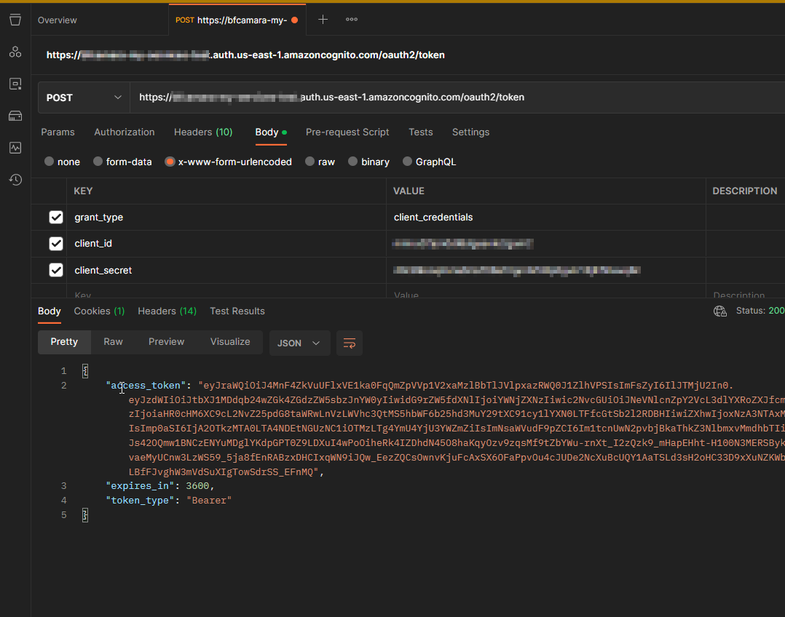


One thing that we can check is the content of the access_token in JWT.IO.´

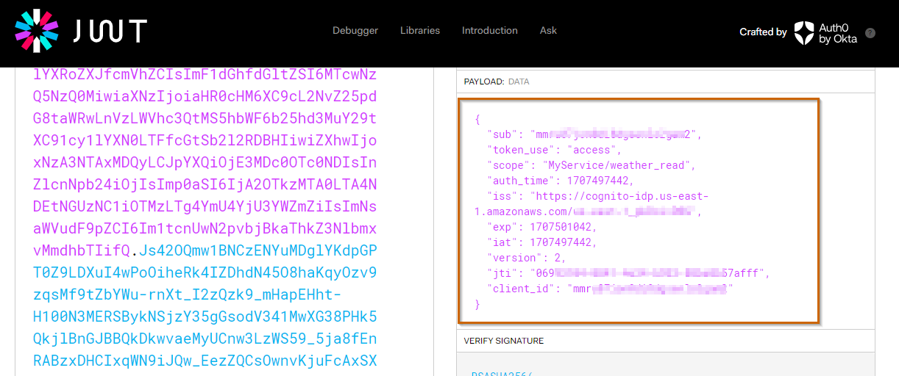

Things to notice:

- The subject claim `sub` (subject) is the `client_id`
- There's no audience `aud` claim
- There's a claim `token_use` with value `access`
- The `scope` claim has the list of scopes of this access token, which in this
  case includes the scope `MyService/weather_read`,

## MyService Setup ##

Now it's time the build the service MyService using ASP.NET Core. I will use Minimal APIs in ASP.NET Core 8.

Let's start by creating a webapi project for MyService.

```bash
dotnet new webapi -o MyService
```

Navigate to folder MyService, and open the project with your preferred editor.
Let's run it from the command line.

```bash
dotnet run --launch-profile https
Building...
info: Microsoft.Hosting.Lifetime[14]
      Now listening on: https://localhost:7062
info: Microsoft.Hosting.Lifetime[14]
      Now listening on: http://localhost:5235
info: Microsoft.Hosting.Lifetime[0]
      Application started. Press Ctrl+C to shut down.
info: Microsoft.Hosting.Lifetime[0]
      Hosting environment: Development
info: Microsoft.Hosting.Lifetime[0]
      Content root path: C:\temp\MyService
```

And let's open the swagger ui in the browser, and execute the operation `GET /weatherforecast`

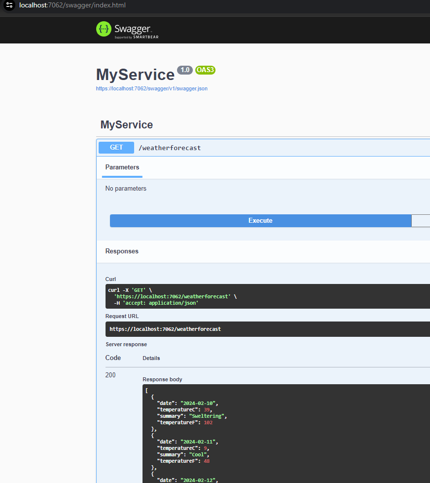

We could do the same with curl

```bash
curl -X 'GET' 'https://localhost:7062/weatherforecast'
[{"date":"2024-02-10","temperatureC":50,"summary":"Balmy","temperatureF":121},{"date":"2024-02-11","temperatureC":48,"summary":"Chilly","temperatureF":118},{"date":"2024-02-12","temperatureC":23,"summary":"Mild","temperatureF":73},{"date":"2024-02-13","temperatureC":50,"summary":"Warm","temperatureF":121},{"date":"2024-02-14","temperatureC":-4,"summary":"Chilly","temperatureF":25}]
```

Now we want to protect MyService in order to only authorize clients with access tokens issued by the AWS Cognito User pool we have created previously. Let' check the initial Program.cs

```csharp
var builder = WebApplication.CreateBuilder(args);
builder.Services.AddEndpointsApiExplorer();
builder.Services.AddSwaggerGen();

var app = builder.Build();

if (app.Environment.IsDevelopment())
{
    app.UseSwagger();
    app.UseSwaggerUI();
}

app.UseHttpsRedirection();

var summaries = new[]
{
    "Freezing", "Bracing", "Chilly", "Cool", "Mild", "Warm", "Balmy", "Hot", "Sweltering", "Scorching"
};

app.MapGet("/weatherforecast", () =>
{
    var forecast =  Enumerable.Range(1, 5).Select(index =>
        new WeatherForecast
        (
            DateOnly.FromDateTime(DateTime.Now.AddDays(index)),
            Random.Shared.Next(-20, 55),
            summaries[Random.Shared.Next(summaries.Length)]
        ))
        .ToArray();
    return forecast;
})
.WithName("GetWeatherForecast")
.WithOpenApi();

app.Run();

record WeatherForecast(DateOnly Date, int TemperatureC, string? Summary)
{
    public int TemperatureF => 32 + (int)(TemperatureC / 0.5556);
}
```

And now let's make the changes. First, since we want to support Jwt token we need to add the nuget package `Microsoft.AspNetCore.Authentication.JwtBearer`

```bash
dotnet add package Microsoft.AspNetCore.Authentication.JwtBearer
```

And now let's check the differences to protect our endpoint.

```csharp{numberLines: true}
using System.Security.Claims;
using Microsoft.AspNetCore.Authorization;

var builder = WebApplication.CreateBuilder(args);

// Register Authentication with JWT Bearer tokens
builder.Services.AddAuthentication().AddJwtBearer();

// Register Authorization Policy based on Scopes
builder.Services.AddAuthorization(options =>
{
    options.AddPolicy("WeatherReadPolicy", policyBuilder =>
    {
        policyBuilder.RequireAuthenticatedUser();
        policyBuilder.RequireClaim("token_use", "access");
        policyBuilder.RequireAssertion(ctx =>
            ctx.User.FindFirstValue("scope")?.Split(' ').Any(s => s.Equals("MyService/weather_read")) ?? false
        );

    });
});

builder.Services.AddEndpointsApiExplorer();
builder.Services.AddSwaggerGen();

var app = builder.Build();

// Configure the HTTP request pipeline.
if (app.Environment.IsDevelopment())
{
    app.UseSwagger();
    app.UseSwaggerUI();
}

app.UseHttpsRedirection();

var summaries = new[] {
    "Freezing", "Bracing", "Chilly", "Cool", "Mild", "Warm", "Balmy", "Hot", "Sweltering", "Scorching"
};

app.MapGet("/weatherforecast", [Authorize(Policy = "WeatherReadPolicy")] () =>
{
    var forecast = Enumerable.Range(1, 5).Select(index =>
        new WeatherForecast
        (
            DateOnly.FromDateTime(DateTime.Now.AddDays(index)),
            Random.Shared.Next(-20, 55),
            summaries[Random.Shared.Next(summaries.Length)]
        ))
        .ToArray();
    return forecast;
})
.WithName("GetWeatherForecast")
.WithOpenApi();

app.Run();

record WeatherForecast(DateOnly Date, int TemperatureC, string? Summary)
{
    public int TemperatureF => 32 + (int)(TemperatureC / 0.5556);
}
```

These are the changes:

- Lines 1-2: Just adding some usings
- Lines 6: Registering the Authentication middleware. It requires registering
  the .well-known url configuration for our user pool
- Lines 7-21; Registering the Authorization middleware, with the policy
  `WeatherReadPolicy` to check for the scope `MyService/weather_read`

In the appsettings.json we need to register the metadata address

```json{12}{numberLines: true}
{
  "Logging": {
    "LogLevel": {
      "Default": "Information",
      "Microsoft.AspNetCore": "Warning"
    }
  },
  "AllowedHosts": "*",
  "Authentication": {
    "Schemes": {
      "Bearer": {
        "MetadataAddress": "https://cognito-idp.us-east-1.amazonaws.com/<your-cognito-user-pool-id>/.well-known/openid-configuration"
      }
    }
  }
}

```


## MyBFF Setup ##
