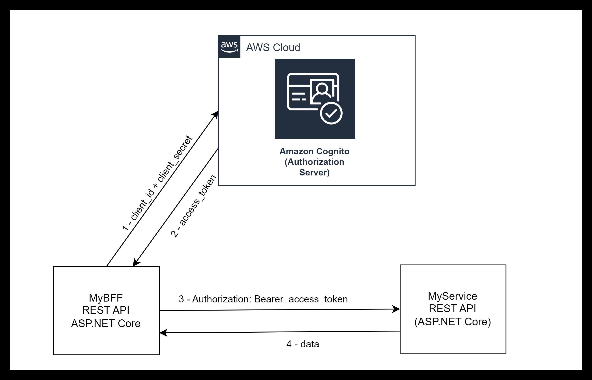
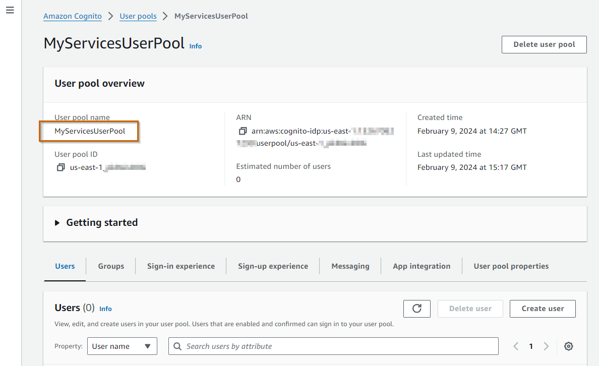
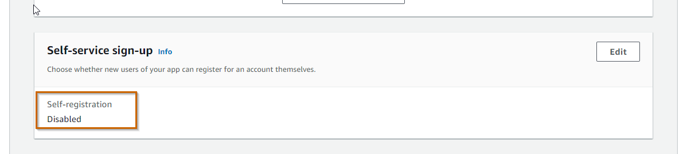
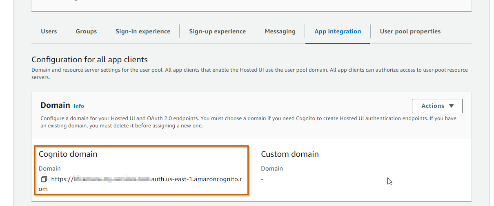
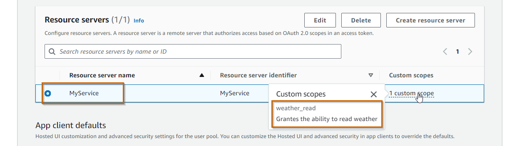
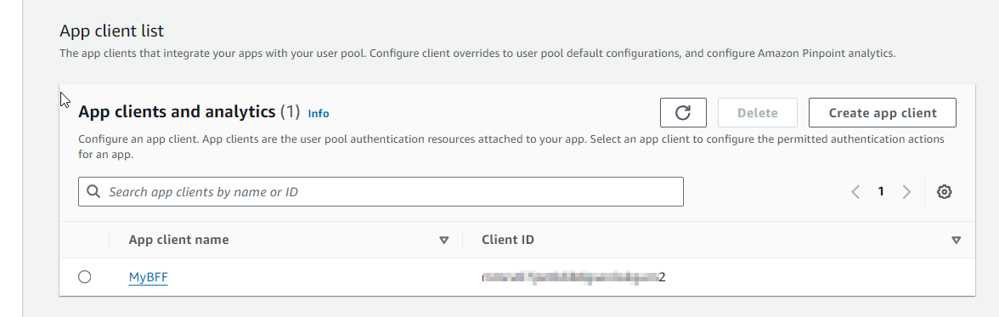
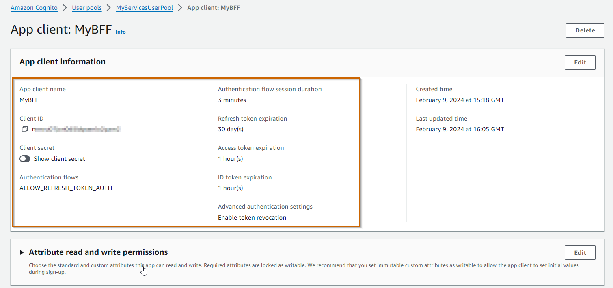

In a Microservices architecture, we typically observe the number of services
increasing as a result of an organic growth, and some services start talking
with other services. Ideally the inter-services communication should be
asynchronous following a publish-subscribe pattern, but in practice we have some
services that need to follow a request-reply pattern.

This is typically the case when we have **[Backends-for-Frontends
(BFF)](https://samnewman.io/patterns/architectural/bff/) acting as separate API
gateways for each front-end client. These BFFs need to talk to other services**,
typically issuing queries to fetch data, or commands to perform business actions
being handled by the downstream service. **Most of the time these interactions
are made through REST APIs**, and **we need to have a way to authorize these
requests, even if all these services are running within the internal network
perimeter** with restrictions from the outside world, **following a [Zero
Trust](https://www.cloudflare.com/learning/security/glossary/what-is-zero-trust/)
strategy**.

Besides BFFs, another scenario where we need to authorize a service is when we
have **external services running on-premise, outside of the cloud, and there's no
human interaction in these services, for example having a windows service that
collects some data from on-premise installations and send it to a service that
lives in the cloud**.

## OAuth 2.0 - Client Credentials Grant flow 🔒 ##

There are several solutions to implement **Service-to-Service authorization**,
known also as **Machine to Machine (M2M) authorization**, such as API keys,
Mutual TLS, OAuth, etc. In this post I want to explore using **[OAuth
2.0](https://oauth.net/2/) with the [Client Credentials Grant
flow](https://datatracker.ietf.org/doc/html/rfc6749#section-4.4)** in the
context of **ASP.NET Core** and **[Amazon
Cognito](https://aws.amazon.com/cognito/)**.



The **OAuth 2.0 Client Credentials Grant flow explained**:

1. When the Client (`MyBFF`) needs to call the Resource Server (`MyService`), if
   it doesn't have a valid access token yet, makes a request to the
   Authorization Server (AWS Cognito) passing tthe `client_id` and
   `client_secret`
1. Amazon Cognito validates the request and returns the `access_token` with a
   given expiration in `expires_in`
1. `MyBFF` calls `MyService` to get some data, passing the `access_token` as a
   `Bearer` token in the `Authorization` header
1. `MyService` validates the request and returns the data if the `Bearer` token
   is valid.

## Amazon Cognito Setup ☁️ ##

To setup Amazon Cognito for our scenario we need the following resources:

1. A **User Pool** - even though we won't have real users in this pool, a User
   Pool is the materialization of an **Authorization Server** in OAuth lingo
1. A **Cognito domain** - **exposes the authorization server** OAuth endpoints in
   a domain
1. A **Resource Server** - **it represents `MyService`**. We will have as many
   resource servers as the number of services.
1. A **Client** - **it represents the Backend-for-Frontend `MyBFF`**. We will have
   as many clients as the number of services that are calling other services.

I'm going to use [CloudFormation](https://docs.aws.amazon.com/cloudformation/)
to create all these resources instead of AWS console because:

- I love CloudFormation - I don't care if I'm locked in to AWS. The truth is
  that **CloudFormation is so simple and so powerful** that I discard any other
  IaC alternative when managing resources inside AWS
- **Amazon Cognito in console is not very intuitive**. In fact I think that's
  one of the disadvantages of Amazon Cognito, when comparing with other
  solutions like Auth0 (considered by many as the best solution in the market in
  this field). I think Amazon Cognito still needs to be polished to remove some
  friction when used by developers and cloud architects.

### Creating a User Pool ###

```yaml
  # Create a user pool
  MyServicesUserPool:
    Type: AWS::Cognito::UserPool
    Properties:
      UserPoolName: "MyServicesUserPool"
      # Disable Self-Service Account Recovery
      AccountRecoverySetting:
        RecoveryMechanisms:
          - Name: admin_only
            Priority: 1
      # Disable Self-Service Signup
      AdminCreateUserConfig:
        AllowAdminCreateUserOnly: true
      # Just in case a user is created by admin
      MfaConfiguration: "ON"
      EnabledMfas:
        - SOFTWARE_TOKEN_MFA
```

The important thing here to notice is that I have disabled all self-service
operations from end-users since we won't have any users registered in the pool.
We can check the result in AWS console.




In the **Sign-in experience** tab


In the **Sign-up experience** tab




### Setting a Cognito domain ###

```yaml
  # Creates a domain with oauth endpoints
  MyServicesUserPoolDomain:
    Type: AWS::Cognito::UserPoolDomain
    Properties:
      Domain: replace-your-domain-here
      UserPoolId: !Ref MyServicesUserPool
```

We are using a AWS Cognito domain:
`https://[replace-your-domain-here].auth.us-east-1.amazoncognito.com`



**Note**: We could have used a custom domain instead of a Amazon Cognito domain,
which requires  adding some DNS records to your DNS zone.

### Creating a Resource Server for `MyService` ###

```yaml
  # Resource Server for MyService
  MyServiceUserPoolResourceServer:
    Type: AWS::Cognito::UserPoolResourceServer
    Properties:
      Identifier: MyService
      Name: MyService
      # Organize scopes
      Scopes:
        - ScopeName: weather_read
          ScopeDescription: Grants the ability to read weather
      UserPoolId: !Ref MyServicesUserPool
```

We can **register whatever scopes we want to support in our service**. In this
case we are just registering one scope `MyService/weather_read` that grants the
ability to read weather data from `MyService` (which will expose an endpoint to
retrieve weather data).

We can check the result in the **App Integration** tab



### Create a Client for `MyBFF` ###

```yaml
  # Client for MyBFF
  MyBFFUserPoolClient:
    Type: AWS::Cognito::UserPoolClient
    DependsOn: MyServiceUserPoolResourceServer
    Properties:
      ClientName: MyBFF
      GenerateSecret: true
      AccessTokenValidity: 1  # Hours
      RefreshTokenValidity: 30  # Days
      AllowedOAuthFlows:
        - client_credentials
      AllowedOAuthFlowsUserPoolClient: true
      AllowedOAuthScopes:
        - MyService/weather_read
      EnableTokenRevocation: true
      ExplicitAuthFlows:
        - ALLOW_REFRESH_TOKEN_AUTH
      UserPoolId: !Ref MyServicesUserPool
```

Basically we are **registering a client, with a secret**, which is only allowed
to trigger the `client_credentials` grant flow with the scopes
`MyService/weather_read`. In other words, we are allowing this client
`MyBFF` to talk to resource server `MyService`.

We can check the result in AWS console, in the **App Integration** tab






### CloudFormation Template for Client Credentials Grant flow ###

I'm not setting all the [**Advanced Security**
features](https://docs.aws.amazon.com/cognito/latest/developerguide/cognito-user-pool-settings-advanced-security.html)
configuration available that we would use in a regular User Pool supporting
other flows that deal with real users (Authorization Code, Implicit, etc,). I'm
also not enabling [**AWS Web Application Firewall
(WAF)**](https://docs.aws.amazon.com/cognito/latest/developerguide/user-pool-waf.html),
which is something that we would do in a real scenario.

This is the template I am using for the example of this blog post.

```yaml
AWSTemplateFormatVersion: "2010-09-09"

Description: AWS Cognito with OAuth Client Credentials Grant flow

Resources:
  # Create a user pool
  MyServicesUserPool:
    Type: AWS::Cognito::UserPool
    Properties:
      UserPoolName: "MyServicesUserPool"
      # Disable Self-Service Account Recovery
      AccountRecoverySetting:
        RecoveryMechanisms:
          - Name: admin_only
            Priority: 1
      # Disable Self-Service Signup
      AdminCreateUserConfig:
        AllowAdminCreateUserOnly: true
      # Just in case a user is created by admin, we require MFA
      MfaConfiguration: "ON"
      EnabledMfas:
        - SOFTWARE_TOKEN_MFA

  # Creates a domain with oauth endpoints
  MyServicesUserPoolDomain:
    Type: AWS::Cognito::UserPoolDomain
    Properties:
      Domain: <your-gognito-domain>
      UserPoolId: !Ref MyServicesUserPool

  # Resource Server for MyService
  MyServiceUserPoolResourceServer:
    Type: AWS::Cognito::UserPoolResourceServer
    Properties:
      Identifier: MyService
      Name: MyService
      Scopes:         # Organize scopes
        - ScopeName: weather_read
          ScopeDescription: Grantes the ability to read weather
      UserPoolId: !Ref MyServicesUserPool

  # Client for MyBFF
  MyBFFUserPoolClient:
    Type: AWS::Cognito::UserPoolClient
    DependsOn: MyServiceUserPoolResourceServer
    Properties:
      AccessTokenValidity: 1
      AllowedOAuthFlows:
        - client_credentials
      AllowedOAuthFlowsUserPoolClient: true
      AllowedOAuthScopes:
        - MyService/weather_read
      ClientName: MyBFF
      EnableTokenRevocation: true
      ExplicitAuthFlows:
        - ALLOW_REFRESH_TOKEN_AUTH
      GenerateSecret: true
      RefreshTokenValidity: 30
      UserPoolId: !Ref MyServicesUserPool

```

We can submit this template as a CloudFormation stack in AWS console and wait for its deployment completion.


At this point we can test the [Token
endpoint](https://docs.aws.amazon.com/cognito/latest/developerguide/token-endpoint.html)
to get a new `access_token`
`https://[replace-your-domain-here].auth.us-east-1.amazoncognito.com/oauth2/token`

```bash
curl --location 'https://replace-your-domain-here.auth.us-east-1.amazoncognito.com/oauth2/token' \
--header 'Content-Type: application/x-www-form-urlencoded' \
--data-urlencode 'grant_type=client_credentials' \
--data-urlencode 'client_id=your_client_id' \
--data-urlencode 'client_secret=your_cliend_secret'
```

Here is the result in Postman


One thing that we can check is the content of the `access_token` in [jwt.io](https://jwt.io/)


Things to notice about the
[access_token](https://docs.aws.amazon.com/cognito/latest/developerguide/amazon-cognito-user-pools-using-the-access-token.html)
issued by AWS Cognito in a Client Crdentials Grant flow:

- The subject claim `sub` (subject) is the `client_id`
- There's no audience `aud` claim
- There's a claim `token_use` with value `access`
- The `scope` claim has the list of scopes, which in this
  case includes the scope `MyService/weather_read`,

## `MyService` Setup (Resource Server) ##

Now it's time to build the service `MyService` using ASP.NET Core. I will use Minimal APIs in ASP.NET Core 8.

Let's start by creating a `webapi` project for `MyService`.

```bash
dotnet new webapi -o MyService
```

Navigate to folder `MyService`, and open the project with your preferred editor.
Let's run it from the command line.

```bash
dotnet run --launch-profile https
Building...
info: Microsoft.Hosting.Lifetime[14]
      Now listening on: https://localhost:7062
info: Microsoft.Hosting.Lifetime[14]
      Now listening on: http://localhost:5235
info: Microsoft.Hosting.Lifetime[0]
      Application started. Press Ctrl+C to shut down.
info: Microsoft.Hosting.Lifetime[0]
      Hosting environment: Development
info: Microsoft.Hosting.Lifetime[0]
      Content root path: C:\temp\MyService
```

Now let's open the swagger ui in the browser, and execute the operation `GET /weatherforecast` to get weather forecast data as a response.


We could do the same with `curl`

```bash
curl -X 'GET' 'https://localhost:7062/weatherforecast'
[{"date":"2024-02-10","temperatureC":50,"summary":"Balmy","temperatureF":121},{"date":"2024-02-11","temperatureC":48,"summary":"Chilly","temperatureF":118},{"date":"2024-02-12","temperatureC":23,"summary":"Mild","temperatureF":73},{"date":"2024-02-13","temperatureC":50,"summary":"Warm","temperatureF":121},{"date":"2024-02-14","temperatureC":-4,"summary":"Chilly","temperatureF":25}]
```

Now **we want to protect `MyService` to only allow authorized clients** with access tokens issued by the AWS Cognito User pool we have created previously.

Let' check the initial `Program.cs` (just removing comments from the initial
template)

```csharp
var builder = WebApplication.CreateBuilder(args);
builder.Services.AddEndpointsApiExplorer();
builder.Services.AddSwaggerGen();

var app = builder.Build();

if (app.Environment.IsDevelopment())
{
    app.UseSwagger();
    app.UseSwaggerUI();
}

app.UseHttpsRedirection();

var summaries = new[]
{
    "Freezing", "Bracing", "Chilly", "Cool", "Mild", "Warm", "Balmy", "Hot", "Sweltering", "Scorching"
};

app.MapGet("/weatherforecast", () =>
{
    var forecast =  Enumerable.Range(1, 5).Select(index =>
        new WeatherForecast
        (
            DateOnly.FromDateTime(DateTime.Now.AddDays(index)),
            Random.Shared.Next(-20, 55),
            summaries[Random.Shared.Next(summaries.Length)]
        ))
        .ToArray();
    return forecast;
})
.WithName("GetWeatherForecast")
.WithOpenApi();

app.Run();

record WeatherForecast(DateOnly Date, int TemperatureC, string? Summary)
{
    public int TemperatureF => 32 + (int)(TemperatureC / 0.5556);
}
```

And now let's make the **changes to protect the `/weatherforecast` endpoint**.
First, and since we want to support JWT tokens, we need to add the nuget package
[`Microsoft.AspNetCore.Authentication.JwtBearer`](https://www.nuget.org/packages/Microsoft.AspNetCore.Authentication.JwtBearer)

```bash
dotnet add package Microsoft.AspNetCore.Authentication.JwtBearer
```

And now let's check the differences in order to protect our endpoint.

```csharp{1-2,6-22,41}{numberLines: true}
using System.Security.Claims;
using Microsoft.AspNetCore.Authorization;

var builder = WebApplication.CreateBuilder(args);

// Register Authentication with JWT Bearer tokens
builder.Services.AddAuthentication().AddJwtBearer();

// Register Authorization Policy based on Scopes
builder.Services.AddAuthorization(options =>
{
    options.AddPolicy("WeatherReadPolicy", policyBuilder =>
    {
        policyBuilder.RequireAuthenticatedUser();
        policyBuilder.RequireClaim("token_use", "access");
        policyBuilder.RequireAssertion(ctx =>
            ctx.User.FindFirstValue("scope")?.Split(' ').Any(s => s.Equals("MyService/weather_read")) ?? false
        );

    });
});

builder.Services.AddEndpointsApiExplorer();
builder.Services.AddSwaggerGen();

var app = builder.Build();

// Configure the HTTP request pipeline.
if (app.Environment.IsDevelopment())
{
    app.UseSwagger();
    app.UseSwaggerUI();
}

app.UseHttpsRedirection();

var summaries = new[] {
    "Freezing", "Bracing", "Chilly", "Cool", "Mild", "Warm", "Balmy", "Hot", "Sweltering", "Scorching"
};

app.MapGet("/weatherforecast", [Authorize(Policy = "WeatherReadPolicy")] () =>
{
    var forecast = Enumerable.Range(1, 5).Select(index =>
        new WeatherForecast
        (
            DateOnly.FromDateTime(DateTime.Now.AddDays(index)),
            Random.Shared.Next(-20, 55),
            summaries[Random.Shared.Next(summaries.Length)]
        ))
        .ToArray();
    return forecast;
})
.WithName("GetWeatherForecast")
.WithOpenApi();

app.Run();

record WeatherForecast(DateOnly Date, int TemperatureC, string? Summary)
{
    public int TemperatureF => 32 + (int)(TemperatureC / 0.5556);
}
```

These are the changes:

- Lines 1-2: Just adding some usings
- Lines 6: **Registering the Authentication middleware**. It requires registering
  the `.well-known` url configuration for our user pool, which is in the `appsettings.json` file (see below)
- Lines 7-21: **Registering the Authorization middleware**, with the policy
  `WeatherReadPolicy` to check for the scope `MyService/weather_read`
- Lines 38: Applying the `[Authorize]` attribute with the policy
  `WeatherReadPolicy` in order to protect the endpoint.

In the `appsettings.json` we need to register the metadata address

```json{9-15}{numberLines: true}
{
  "Logging": {
    "LogLevel": {
      "Default": "Information",
      "Microsoft.AspNetCore": "Warning"
    }
  },
  "AllowedHosts": "*",
  "Authentication": {
    "Schemes": {
      "Bearer": {
        "MetadataAddress": "https://cognito-idp.us-east-1.amazonaws.com/<your-cognito-user-pool-id>/.well-known/openid-configuration"
      }
    }
  }
}

```

Let's call again the endpoint without any authorization, and we should see an
error.

```bash
curl -X 'GET' 'https://localhost:7062/weatherforecast' -i
```

```bash
HTTP/1.1 401 Unauthorized
Content-Length: 0
Date: Mon, 12 Feb 2024 12:21:58 GMT
Server: Kestrel
WWW-Authenticate: Bearer
```

As expected, the service returns now a `401 Unauthorized`.

Let's call the endpoint with a valid bearer token returned from the Cognito token endpoint

```bash
 curl -X 'GET' 'https://localhost:7062/weatherforecast' -i -H 'Authorization: Bearer <your-access-token>'
 ```

 ```bash
HTTP/1.1 200 OK
Content-Type: application/json; charset=utf-8
Date: Mon, 12 Feb 2024 12:24:16 GMT
Server: Kestrel
Transfer-Encoding: chunked

[{"date":"2024-02-13","temperatureC":41,"summary":"Cool","temperatureF":105},{"date":"2024-02-14","temperatureC":4,"summary":"Freezing","temperatureF":39},{"date":"2024-02-15","temperatureC":50,"summary":"Cool","temperatureF":121},{"date":"2024-02-16","temperatureC":5,"summary":"Sweltering","temperatureF":40},{"date":"2024-02-17","temperatureC":8,"summary":"Hot","temperatureF":46}]
```

We got a `200 OK`. Now that we have `MyService`, the Resource Server, behaving as expected, let's setup the client, i.e, `MyBFF`.

## `MyBFF` Setup (Client) ##

Let's repeat the ASP.NET Core setup for the Backend-for-frontend `MyBFF`.

```bash
dotnet new webapi -o MyBFF
```

Go to folder `MyBFF`, and using your preferred editor, replace the endpoint
logic of `/weatherforecast` to make a REST API call to `MyService` in order to
get weather forecast data. I am using the [Refit
library](https://github.com/reactiveui/refit) to make the REST call, which means
that I need to add the nuget package
[`Refit.HttpClientFactory`](https://www.nuget.org/packages/Refit.HttpClientFactory)

```bash
dotnet add package Refit.HttpClientFactory
```

And here is the code.

```csharp{1-2,9-10,23-26,32-38}{numberLines: true}
using Microsoft.AspNetCore.Mvc;
using Refit;

var builder = WebApplication.CreateBuilder(args);

builder.Services.AddEndpointsApiExplorer();
builder.Services.AddSwaggerGen();

builder.Services.AddRefitClient<IMyServiceClient>()
    .ConfigureHttpClient(client => client.BaseAddress = new Uri("https://localhost:7062"));

var app = builder.Build();

// Configure the HTTP request pipeline.
if (app.Environment.IsDevelopment())
{
    app.UseSwagger();
    app.UseSwaggerUI();
}

app.UseHttpsRedirection();

app.MapGet("/weatherforecast", ([FromServices] IMyServiceClient myServiceClient) =>
{
    return myServiceClient.GetWeatherForecast();
})
.WithName("GetWeatherForecast")
.WithOpenApi();

app.Run();

record WeatherForecast(DateOnly Date, int TemperatureC, string? Summary);

interface IMyServiceClient
{
    [Get("/weatherforecast")]
    Task<WeatherForecast[]> GetWeatherForecast();
}
```

Let's check the differences from the original template:

- Lines 1-2: Just adding some usings
- Lines 32-38: **Take advantage of Refit library and define an interface to
  represent MyService's REST API client**
- Lines 9-10: **Registering the REST API client** for `MyService`
- Lines 23-26: **Call `MyService`** to get weather forecast

At this point, if we run `MyBFF` and call its endpoint `/weatherforecast` we
should see an error since we are doing an unauthorized call to `MyService`
because we don't have any logic yet to pass a JWT bearer token when doing the
call.

Assuming that `MyService` is running and listening at `https://localhost:7062`,
let's also run `MyBFF`. In `MyBFF` folder

```bash
dotnet run --launch-profile https
```

```bash
Building...
info: Microsoft.Hosting.Lifetime[14]
      Now listening on: https://localhost:7248
info: Microsoft.Hosting.Lifetime[14]
      Now listening on: http://localhost:5006
info: Microsoft.Hosting.Lifetime[0]
      Application started. Press Ctrl+C to shut down.
info: Microsoft.Hosting.Lifetime[0]
      Hosting environment: Development
info: Microsoft.Hosting.Lifetime[0]
      Content root path: C:\temp\MyBFF
```

And now **let's call `MyBFF` endpoint** `https://localhost:7248/weatherforecast`

```bash
curl -X 'GET' 'https://localhost:7248/weatherforecast' -i
```

```
HTTP/1.1 500 Internal Server Error
Content-Type: text/plain; charset=utf-8
Date: Mon, 12 Feb 2024 11:03:38 GMT
Server: Kestrel
Transfer-Encoding: chunked

Refit.ApiException: Response status code does not indicate success: 401 (Unauthorized).
   at Refit.RequestBuilderImplementation.<>c__DisplayClass14_0`2.<<BuildCancellableTaskFuncForMethod>b__0>d.MoveNext() in /_/Refit/RequestBuilderImplementation.cs:line 288
--- End of stack trace from previous location ---
   at Microsoft.AspNetCore.Http.RequestDelegateFactory.<ExecuteTaskOfTFast>g__ExecuteAwaited|132_0[T](Task`1 task, HttpContext httpContext, JsonTypeInfo`1 jsonTypeInfo)
   at Swashbuckle.AspNetCore.SwaggerUI.SwaggerUIMiddleware.Invoke(HttpContext httpContext)
   at Swashbuckle.AspNetCore.Swagger.SwaggerMiddleware.Invoke(HttpContext httpContext, ISwaggerProvider swaggerProvider)
   at Microsoft.AspNetCore.Diagnostics.DeveloperExceptionPageMiddlewareImpl.Invoke(HttpContext context)

HEADERS
=======
Accept: */*
Host: localhost:7248
User-Agent: curl/8.4.0
```

**Note ⚠️**: detailed exception information is being returned because I'm running
in a Development environment. **In Production we should not return any detailed
information about the exception**.

Basically we are getting a `500 Internal Server Error` as a **result of a failed call to MyService, which is returning a `401 Unauthorized` to `MyBFF`**. We can also check the logs of `MyBFF`

```bash{7-11}{numberLines: true}
info: Microsoft.Hosting.Lifetime[0]
      Content root path: C:\temp\MyBFF
info: System.Net.Http.HttpClient.Refit.Implementation.Generated+IMyServiceClient, MyBFF, Version=1.0.0.0, Culture=neutral, PublicKeyToken=null.LogicalHandler[100]
      Start processing HTTP request GET https://localhost:7062/weatherforecast
info: System.Net.Http.HttpClient.Refit.Implementation.Generated+IMyServiceClient, MyBFF, Version=1.0.0.0, Culture=neutral, PublicKeyToken=null.ClientHandler[100]
      Sending HTTP request GET https://localhost:7062/weatherforecast
info: System.Net.Http.HttpClient.Refit.Implementation.Generated+IMyServiceClient, MyBFF, Version=1.0.0.0, Culture=neutral, PublicKeyToken=null.ClientHandler[101]
      Received HTTP response headers after 73.9603ms - 401
info: System.Net.Http.HttpClient.Refit.Implementation.Generated+IMyServiceClient, MyBFF, Version=1.0.0.0, Culture=neutral, PublicKeyToken=null.LogicalHandler[101]
      End processing HTTP request after 92.3572ms - 401
fail: Microsoft.AspNetCore.Diagnostics.DeveloperExceptionPageMiddleware[1]
      An unhandled exception has occurred while executing the request.
      Refit.ApiException: Response status code does not indicate success: 401 (Unauthorized).
         at Refit.RequestBuilderImplementation.<>c__DisplayClass14_0`2.<<BuildCancellableTaskFuncForMethod>b__0>d.MoveNext() in /_/Refit/RequestBuilderImplementation.cs:line 288
      --- End of stack trace from previous location ---
         at Microsoft.AspNetCore.Http.RequestDelegateFactory.<ExecuteTaskOfTFast>g__ExecuteAwaited|132_0[T](Task`1 task, HttpContext httpContext, JsonTypeInfo`1 jsonTypeInfo)
         at Swashbuckle.AspNetCore.SwaggerUI.SwaggerUIMiddleware.Invoke(HttpContext httpContext)
         at Swashbuckle.AspNetCore.Swagger.SwaggerMiddleware.Invoke(HttpContext httpContext, ISwaggerProvider swaggerProvider)
         at Microsoft.AspNetCore.Diagnostics.DeveloperExceptionPageMiddlewareImpl.Invoke(HttpContext context)
```

To fix it, before calling `MyService`, we need to be sure that we have a valid
`access_token` to pass it as bearer token in the authorization header. Basically
we need the following logic in the REST client:

1. check if we have a valid `access_token`:

    - if no valid `access_token` exists, we need to **call the Authorization
      Server passing the `client_id` and `client_secret` to get a new
      `access_token`**

1. Pass the `access_token` as a bearer token in the `Authorization` header.

We can use the `IdentityModel` library to help us implementing this logic in
`MyBFF`, which means that we need to install the nuget package
[`IdentityModel.AspnetCore`](https://www.nuget.org/packages?q=IdentityModel.AspnetCore)

```bash
dotnet add package IdentityModel.AspnetCore
```

Now, we just need to **register the Access Token Management Service** provided by the `IdentityModel` library and attach it to the `Refit` http Client.

```csharp
builder.Services.AddAccessTokenManagement(options =>
{
    options.Client.Clients.Add("MyBFF", new()
    {
        RequestUri = new Uri(builder.Configuration["AUTH_SERVER_TOKEN_ENDPOINT_URL"]!),
        ClientId = builder.Configuration["AUTH_SERVER_MYBFF_CLIENT_ID"],
        ClientSecret = builder.Configuration["AUTH_SERVER_MYBFF_CLIENT_SECRET"]
    });
});

builder.Services.AddRefitClient<IMyServiceClient>()
    .ConfigureHttpClient(client => client.BaseAddress = new Uri("https://localhost:7062"))
    .AddClientAccessTokenHandler("MyBFF");
```

Just be sure that you add the following configuration keys to the configuration source that you are using.

- `AUTH_SERVER_TOKEN_ENDPOINT_URL` - For a AWS Cognito domain it should be
  `https://[your-chosen-domain].auth.us-east-1.amazoncognito.com`
- `AUTH_SERVER_MYBFF_CLIENT_ID` - the client id
- `AUTH_SERVER_MYBFF_CLIENT_SECRET` - the client secret

**Note ⚠️**: **Do not store secrets in source control**

Now let's run again `MyBFF`, but this time **increasing the log level to debug**
to see what's happening inside the access token management service.

```bash
dotnet run --launch-profile https --Logging:LogLevel:Default=Debug
```

```bash
Building...
dbug: Microsoft.Extensions.Hosting.Internal.Host[1]
      Hosting starting
info: Microsoft.Hosting.Lifetime[14]
      Now listening on: https://localhost:7248
info: Microsoft.Hosting.Lifetime[14]
      Now listening on: http://localhost:5006
info: Microsoft.Hosting.Lifetime[0]
      Application started. Press Ctrl+C to shut down.
info: Microsoft.Hosting.Lifetime[0]
      Hosting environment: Development
info: Microsoft.Hosting.Lifetime[0]
      Content root path: C:\temp\MyBFF
dbug: Microsoft.Extensions.Hosting.Internal.Host[2]
      Hosting started
```

Now let's call `MyBFF` `/wetherforecast` endpoint

```bash
curl -X 'GET' 'https://localhost:7248/weatherforecast' -i
```

```bash
HTTP/1.1 200 OK
Content-Type: application/json; charset=utf-8
Date: Mon, 12 Feb 2024 11:59:31 GMT
Server: Kestrel
Transfer-Encoding: chunked

[{"date":"2024-02-13","temperatureC":13,"summary":"Cool"},{"date":"2024-02-14","temperatureC":-16,"summary":"Cool"},{"date":"2024-02-15","temperatureC":34,"summary":"Hot"},{"date":"2024-02-16","temperatureC":28,"summary":"Cool"},{"date":"2024-02-17","temperatureC":14,"summary":"Hot"}]
```

We got a `200 OK` and weather forecast data was returned, which means that the REST call to `MyService` has succeeded. Let's check the logs

```bash{5-10,19-20}{numberLines: true}
dbug: Microsoft.Extensions.Hosting.Internal.Host[2]
      Hosting started
info: System.Net.Http.HttpClient.Refit.Implementation.Generated+IMyServiceClient, MyBFF, Version=1.0.0.0, Culture=neutral, PublicKeyToken=null.LogicalHandler[100]
      Start processing HTTP request GET https://localhost:7062/weatherforecast
dbug: IdentityModel.AspNetCore.AccessTokenManagement.ClientAccessTokenCache[0]
      Cache miss for access token for client: MyBFF
dbug: IdentityModel.AspNetCore.AccessTokenManagement.TokenEndpointService[0]
      Requesting client access token for client: MyBFF
dbug: IdentityModel.AspNetCore.AccessTokenManagement.DefaultTokenClientConfigurationService[0]
      Returning token client configuration for client: MyBFF
info: System.Net.Http.HttpClient.IdentityModel.AspNetCore.AccessTokenManagement.TokenEndpointService.LogicalHandler[100]
      Start processing HTTP request POST https://your-cognito-domain.auth.us-east-1.amazoncognito.com/oauth2/token
info: System.Net.Http.HttpClient.IdentityModel.AspNetCore.AccessTokenManagement.TokenEndpointService.ClientHandler[100]
      Sending HTTP request POST https://your-cognito-domain.auth.us-east-1.amazoncognito.com/oauth2/token
info: System.Net.Http.HttpClient.IdentityModel.AspNetCore.AccessTokenManagement.TokenEndpointService.ClientHandler[101]
      Received HTTP response headers after 549.6799ms - 200
info: System.Net.Http.HttpClient.IdentityModel.AspNetCore.AccessTokenManagement.TokenEndpointService.LogicalHandler[101]
      End processing HTTP request after 556.8406ms - 200
dbug: IdentityModel.AspNetCore.AccessTokenManagement.ClientAccessTokenCache[0]
      Caching access token for client: MyBFF. Expiration: 02/12/2024 12:08:31 +00:00
info: System.Net.Http.HttpClient.Refit.Implementation.Generated+IMyServiceClient, MyBFF, Version=1.0.0.0, Culture=neutral, PublicKeyToken=null.ClientHandler[100]
      Sending HTTP request GET https://localhost:7062/weatherforecast
info: System.Net.Http.HttpClient.Refit.Implementation.Generated+IMyServiceClient, MyBFF, Version=1.0.0.0, Culture=neutral, PublicKeyToken=null.ClientHandler[101]
      Received HTTP response headers after 15.9003ms - 200
info: System.Net.Http.HttpClient.Refit.Implementation.Generated+IMyServiceClient, MyBFF, Version=1.0.0.0, Culture=neutral, PublicKeyToken=null.LogicalHandler[101]
      End processing HTTP request after 601.1684ms - 200
```

From the logs we can see that:

1. The **token management service got a cache miss** when checking for the
   access token
1. The **token management service has requested a new token**
1. The REST call to `MyService` has succeeded
1. The **token management service has cached the access token**

Now let's call it a 2nd time, hoping this time we get a cache hit and reuse the
access token. Here are the logs we got this time:

```bash{5-6}{numberLines: true}
info: System.Net.Http.HttpClient.Refit.Implementation.Generated+IMyServiceClient, MyBFF, Version=1.0.0.0, Culture=neutral, PublicKeyToken=null.LogicalHandler[101]
      End processing HTTP request after 658.9196ms - 200
info: System.Net.Http.HttpClient.Refit.Implementation.Generated+IMyServiceClient, MyBFF, Version=1.0.0.0, Culture=neutral, PublicKeyToken=null.LogicalHandler[100]
      Start processing HTTP request GET https://localhost:7062/weatherforecast
dbug: IdentityModel.AspNetCore.AccessTokenManagement.ClientAccessTokenCache[0]
      Cache hit for access token for client: MyBFF
info: System.Net.Http.HttpClient.Refit.Implementation.Generated+IMyServiceClient, MyBFF, Version=1.0.0.0, Culture=neutral, PublicKeyToken=null.ClientHandler[100]
      Sending HTTP request GET https://localhost:7062/weatherforecast
info: System.Net.Http.HttpClient.Refit.Implementation.Generated+IMyServiceClient, MyBFF, Version=1.0.0.0, Culture=neutral, PublicKeyToken=null.ClientHandler[101]
      Received HTTP response headers after 4.1808ms - 200
info: System.Net.Http.HttpClient.Refit.Implementation.Generated+IMyServiceClient, MyBFF, Version=1.0.0.0, Culture=neutral, PublicKeyToken=null.LogicalHandler[101]
      End processing HTTP request after 4.8902ms - 200
```

**Confirmed! We got a cache hit, and the `access_token` is being reused**. When the token expires, we will get again a cache miss, and a new token will be requested.

In this blog post I am using ASP.NET Core as an example, but the principles used here can be used whatever the programming language you are using. I am also not assuming anything about the host where the services are running - it can be On-Premise, in an EC2 instance, in a AWS Lambda + API Gateway, etc. - it works in whatever host.

## Conclusion ##

In this blog post I tried to **show how simple and easy it is to authorize Service-to-Service calls by using OAuth2 with Client Credentials grant flow**,  using **AWS Cognito** as the Authorization Server, and **ASP.NET Core** APIs as both Resource Servers or Clients.
