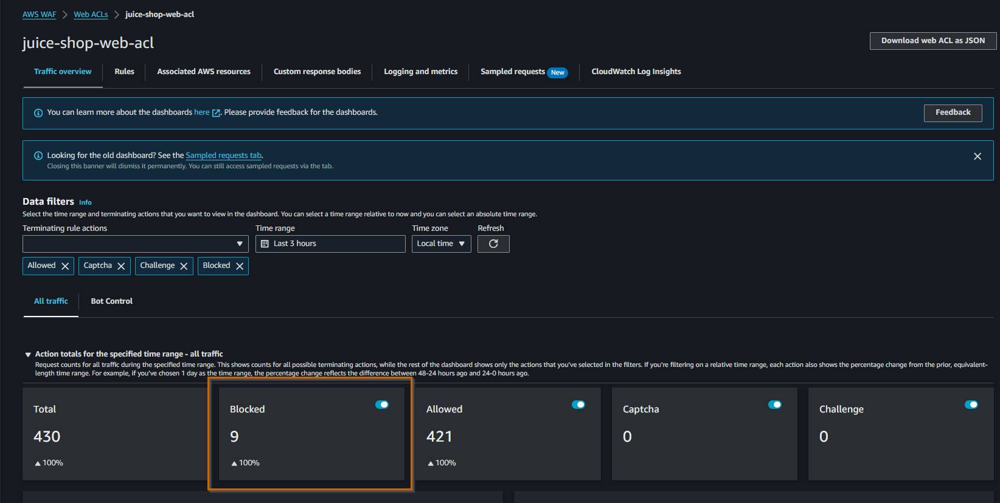

_**TL;DR**: Consider seriously using a WAF in front of your public web apps/APIs. Also, consider educating your developers about the OWASP Top 10 security list._

When we expose our web applications or APIs to the internet, we are exposing the
features that add value to our customers, but we are also exposing our
applications vulnerabilities ready to be exploited. **We need to be prepared to
cope with malicious actors**. We should do our best and use the best tools to
prevent a cyber attack. This is even more true when we expose an app that we
don't know in detail. Imagine a company that has just acquired another company
and the due diligence during the acquisition didn't include a legacy web app
that is being exposed to its customers.

**We don't know how vulnerable the app is until we do some exploratory work,
penetration testing, code reviews, threat modelling analysis, etc**. Probably it's a legacy
app that nobody touches for years and that has some security holes which can be
exploited by a threat actor.

## Web Application Firewall (WAF) ##

**As a first line of defense, we can use a Web Application Firewall (WAF)**.
Basically a WAF protects web apps/APIs by inspecting HTTP requests. It acts at
the layer 7 (Application Layer of the [OSI
Model](https://www.fortinet.com/resources/cyberglossary/osi-model)) and it
behaves like a reverse proxy with policies and rules attached to it to protect
malicious requests, preventing them to flow to our servers or services. Using
a **WAF doesn't replace other initiatives that we should be doing in our apps
such as code reviews, penetration tests, threat modelling analysis, etc**. And
most of all, **using a WAF doesn't mean that we don't need to adopt security
engineering practices while writing or deploying our apps**. At the end of the
day, a WAF is just one more tool at our disposal that we can use to make the
life of a threat actor harder.

There are several WAFs we can use, but if our workloads are running in AWS, the
natural choice is to use [AWS WAF](https://aws.amazon.com/waf/). This is not
mandatory. In a previous company I worked for, we were using [Cloudflare
WAF](https://developers.cloudflare.com/waf/) in front of our AWS and Azure
public workloads.

When we start using a WAF in front of our apps, it's normal that we break some
functionality because we start blocking some requests that WAF considers
potential malicious, even if they are legit. We should test our apps and select
and tweak the WAF rules that must be applied to our web app or API.

**We should never forget that a WAF is just the first line of defense - our app
should be written with security in mind and assuming breach ([Zero
Trust](https://learn.microsoft.com/en-us/security/zero-trust/zero-trust-overview)),
and we have to protect it against malicious actors.**

## OWASP Top 10 ##

As developers we should be aware of the [OWASP Top
10](https://owasp.org/www-project-top-ten/), which represents **the list of the
most critical security risks to web applications**. I would say that it consists
of the top 10 concerns that we, developers, should have on our head when
developing and writing our apps. (Broken access control, Injection, Cryptographic
failures, etc.).

When developing features, developers are so focused on the feature itself that
sometimes they forget to add some security checks. That's when we typically
introduce vulnerabilities without even noticing. If we have **a code review
process in place, we can minimize these risks by having team mates reviewing our
pull request and signing off. If we have CI/CD pipelines that run security
checks on each change before deploying into production, and prevents deployment
if it detects critical or high risk vulnerabilities, even better**.

In this post, I don't want to go into the details of the OWASP Top 10 list. I
just want to show a possible setup for developers to be able to explore AWS WAF
to protect against these risks. To start exploring WAF, we need a vulnerable app
to serve as a playground.

## OWASP Juice Shop ##

[OWASP Juice Shop](https://owasp.org/www-project-juice-shop/) is a vulnerable
web application, designed intentionally as insecure, and it can be used as a
training tool. The app exposes vulnerabilities from the OWASP Top 10 list, and
also other security flaws. **What we want is to be able to explore vulnerabilities
and to check how AWS WAF behaves to prevent them**. Basically we want to use Juice
Shop as "guinea pig" to AWS WAF.

To be able to assess how WAF behaves we need to perform two installations of
Juice Shop:

- One installation without any protection - for this I will use docker locally.
- One installation with WAF - for this I will use [AWS AppRunner](https://aws.amazon.com/apprunner/)

### Installing Juice Shop Locally (Docker) ###

To install Juice Shop locally I'm going to use docker with the official image
[bkimminich/juice-shop](https://hub.docker.com/r/bkimminich/juice-shop)

```bash
docker pull bkimminich/juice-shop
```

```bash
Using default tag: latest
latest: Pulling from bkimminich/juice-shop
07a64a71e011: Pull complete
fe5ca62666f0: Pull complete
...
Digest: sha256:4a80df64f0430b73955b97a653d31adb1f7782417b900c930805c7084b5dfe41
Status: Downloaded newer image for bkimminich/juice-shop:latest
docker.io/bkimminich/juice-shop:latest
```

And then running it

```bash
docker run -e "NODE_ENV=unsafe" --rm -p 3000:3000 bkimminich/juice-shop
```
```bash
info: All dependencies in ./package.json are satisfied (OK)
info: Detected Node.js version v20.10.0 (OK)
info: Detected OS linux (OK)
info: Detected CPU x64 (OK)
info: Configuration default validated (OK)
info: Entity models 19 of 19 are initialized (OK)
info: Required file server.js is present (OK)
info: Required file index.html is present (OK)
info: Required file styles.css is present (OK)
info: Required file main.js is present (OK)
info: Required file polyfills.js is present (OK)
info: Required file runtime.js is present (OK)
info: Required file vendor.js is present (OK)
info: Port 3000 is available (OK)
info: Domain https://www.alchemy.com/ is reachable (OK)
info: Chatbot training data botDefaultTrainingData.json validated (OK)
info: Server listening on port 3000
```

I'm adding the environment variable `NODE_ENV=unsafe` to be sure that all
challenges are available, even those considered dangerous. Let's try and open
our browser locally on port 3000.


OWASP Juice Shop provides interactive training tutorials, and presents vulnerabilities as challenges that we need to discover. It's really cool as a training security tool for developers. The first challenge is to discover the Score Board page where you can track your progress.


## Installing Juice Shop in AWS AppRunner ##

To run OWASP Juice Shop in AWS, I've chosen AWS AppRunner service. The OWASP
Juice docs suggest to use an EC2 instance, but I prefer to use the AppRunner
service which is much simpler (we don't need to setup a VPC).

I am going to configure the AppRunner service to use the official docker image.
We need to push this image to a private registry in [AWS
ECR](https://docs.aws.amazon.com/AmazonECR/latest/userguide/what-is-ecr.html). I
am going to use the aws cli to create a repository `juice-shop` in my private
registry of my aws account.

```bash
aws ecr create-repository --repository-name juice-shop
```


To be able to push images to this new repository, we need to login docker into
our ECR registry.

```bash
aws ecr get-login-password | docker login --username AWS --password-stdin <your-account-id>.dkr.ecr.us-east-1.amazonaws.com
```


Check the list of images

```bash
docker images
```


Then we just need to push our image

```bash
docker tag 402fefa2b068 <account-id>.dkr.ecr.us-east-1.amazonaws.com/juice-shop:latest
```
```bash
docker push <account-id>.dkr.ecr.us-east-1.amazonaws.com/juice-shop:latest
```


In the AWS Console we should see the image published


Now we can use this image in our AppRunner Service. Navigate to the AppRunner service and create a new service, specifying the docker image URI for the service


Then just give the name `juice-shop` and specify the cpu and memory.


For now we can assume all the defaults. We are not associating yet any WAF to our service. Let's first be sure that we are able to run the service. Just review the info on the last step of the wizard and create and deploy the service. AppRunner will take several minutes to perform its magic to deploy the service and expose it to the internet.


You can click on the link and you should see the Juice Shop


Remember that we are still not running Juice Shop with any WAF.

## Setting AWS WAF in Juice Shop App Runner ##

Now that we have Juice Shop running in AWS, let's put it behind a AWS WAF. **We
first need create a Web access control list ([Web
ACL](https://docs.aws.amazon.com/waf/latest/developerguide/web-acl.html))**. A
Web ACL defines the set of rules we want to apply to our resource, in this case
our AWS AppRunner service. We can associate a web acl to protect other resources
such as Amazon CloudFront, Amazon API Gateway, Application Load Balancer, Amazon
Cognito, etc. Let's create a web acl with the name `juice-shop-web-acl`


In this context I want to start with the common rules to protect against that the OWASP Top 10 list. AWS WAF supports out of the box a set of rules that we can enable.


Under AWS Managed Rules, enable the rules that you want to explore. For now I am going to try the Core Rule set to protect against many of the OWASP Top 10 list, and also the SQL database rule set to protect against the popular SQL injection attack.


The rules are organized into groups and are maintained by AWS and AWS Marketplace sellers (Fortinet, Cloudbric, F5, etc.). For now, we can go with the defaults on the rest of the wizard.


Now we need to associate this Web ACL to our AppRunner service. We could have
done this step directly while we were creating the web acl, but we can also
configure this association in the AppRunner service. Let's go to the AppRunner
service and change the configuration.


In the Security panel, activate the WAF and select the Web ACL that we created.


Save changes and wait. It takes some time to update the service with the association.


After updated with success, **we are now  in conditions to start comparing the behavior of Juice Shop with and without WAF**.

## Testing WAF with SQL Injection ##

Let's **start by the well known SQL Injection attack in the login page to access
to the authenticated part of the web, even without knowing any login
credentials**. Starting with the unprotected version of the site that I am
running locally, go to the login page, and I just need to put `' OR 1=1--` in
the Email text box, and in the Password text box we can put any value we want.


And here is the result


Basically I am authenticated as the administrator. The SQL injection attack was a success.

Now let's try to do the same in the version running in AWS with WAF protection.


When we click in the Login button, nothing happens. Apparently **WAF is blocking
the request**. Let's confirm it in the Developer Tools.


As soon as we open the developer tools, we can see some console errors, and we
notice that **a `POST` request to the login endpoint is being blocked with a 403
Forbidden**. Let's inspect what we got in the wire.


We can check in AWS Web ACL the Traffic Overview



We can even check some sample requests


Here is the detail of the request that was blocked.


**The request was blocked by the rule
[`SQLi_BODY`](https://docs.aws.amazon.com/waf/latest/developerguide/aws-managed-rule-groups-use-case.html#aws-managed-rule-groups-use-case-sql-db). We can say that AWS WAF has prevented the SQL injection attack.**

Let's explore another attack vector.

## Testing WAF with Cross-Site Scripting (XSS) ##

Now let's try another common attack with XSS. Running locally, let's go to the new customer page and register a new customer with the name `<iframe src="javascript:alert('xss')">`. You should notice that there's a client side validation for the email.


Instead of using the frontend, let's hit directly the API endpoint using Postman


**The API endpoint is not validating the email field, and we were able to register
something in the database as a user that is not a valid email address. In fact
we are injecting a script**. Let's see in the Administration screen, where the
list of users is shown, how this user is being displayed. Navigate as
administrator (by using sql injection) to http://localhost:3000/#/administration


We are getting the alert box, which is exactly the script we have injected. **The
XSS attack was succeeded, and we could run a malicious script on the
administration page**.

Now let's repeat the same API request in the version that is running behind WAF in AWS.


We are being blocked with a 403 Forbidden as expected. Let's check the WAF sample requests.


**This request was blocked by the rule `CrossSiteScripting_BODY`. We can say that WAF has prevented the XSS attack as expected**.

We can continue our exploration of other attack vectors by visiting each Juice
Shop challenge and check if AWS WAF helps to protect against them in some way.

## Conclusion ##

**A Web Application Firewall (WAF) is definitely a tool that we should consider
using in front of our public face apps and services**. Not having a WAF, is like
riding a mountain bike without a helmet. We should always remember that **a WAF
is our fist line of defense, but it doesn't prevent all attacks**. As
developers, we should write our apps with the OWASP Top 10 list in mind to be
sure that our app is secure, even without a WAF. 

AWS WAF is the natural adoption for workloads running in AWS and it supports out of the box many rules to protect against common attacks. The Web ACLs need to be tweaked for the app that is going to be protected.

**As a final message, consider seriously using a WAF in front of your public apps. It's something that you won't regret, even if it costs you some money. But I'm sure that it will cost you even more if you are a victim of a cyber attack.**

